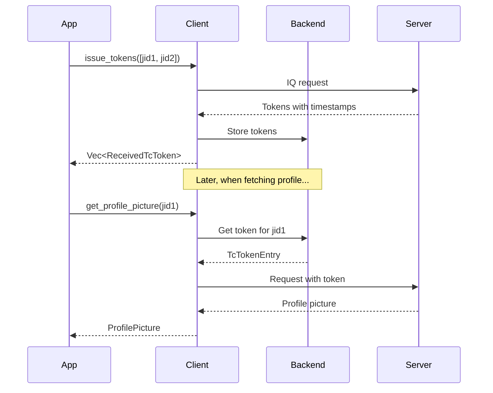

The `TcToken` feature provides APIs for issuing and managing trusted contact privacy tokens (TC tokens). These tokens are used for privacy-gated operations like fetching profile pictures.

## Access

Access TC token operations through the client:

```rust
let tc_token = client.tc_token();
```

## Methods

### issue_tokens

Issue privacy tokens for specified contacts.

```rust
pub async fn issue_tokens(&self, jids: &[Jid]) -> Result<Vec<ReceivedTcToken>, IqError>
```

**Parameters:**
- `jids` - Array of JIDs (should be LID JIDs) to issue tokens for

**Returns:**
- `Vec<ReceivedTcToken>` - List of received tokens

**Example:**
```rust
let jids = vec![
    "100000000000001@lid".parse()?,
    "100000000000002@lid".parse()?,
];

let tokens = client.tc_token().issue_tokens(&jids).await?;

for token in &tokens {
    println!("Token for {}: {} bytes", token.jid, token.token.len());
    println!("Timestamp: {}", token.timestamp);
}
```

<Note>
Issued tokens are automatically stored in the backend and used for subsequent operations like profile picture fetching.
</Note>

### prune_expired

Remove expired tokens from storage.

```rust
pub async fn prune_expired(&self) -> Result<u32, anyhow::Error>
```

**Returns:**
- Number of tokens deleted

**Example:**
```rust
let deleted = client.tc_token().prune_expired().await?;
println!("Pruned {} expired tokens", deleted);
```

<Note>
Tokens expire after 28 days. Call this periodically to clean up storage.
</Note>

### get

Get a stored token for a specific JID.

```rust
pub async fn get(&self, jid: &str) -> Result<Option<TcTokenEntry>, anyhow::Error>
```

**Parameters:**
- `jid` - User portion of the JID (without domain)

**Returns:**
- `Option<TcTokenEntry>` - The stored token entry, if found

**Example:**
```rust
if let Some(entry) = client.tc_token().get("100000000000001").await? {
    println!("Token timestamp: {}", entry.token_timestamp);
    println!("Token size: {} bytes", entry.token.len());
    
    if let Some(sender_ts) = entry.sender_timestamp {
        println!("Issued at: {}", sender_ts);
    }
}
```

### get_all_jids

Get all JIDs that have stored tokens.

```rust
pub async fn get_all_jids(&self) -> Result<Vec<String>, anyhow::Error>
```

**Returns:**
- List of JID user portions with stored tokens

**Example:**
```rust
let jids = client.tc_token().get_all_jids().await?;
println!("Tokens stored for {} contacts", jids.len());

for jid in jids {
    println!("  - {}", jid);
}
```

## Types

### ReceivedTcToken

Token received from the server.

```rust
pub struct ReceivedTcToken {
    /// JID the token is for
    pub jid: Jid,
    /// Binary token data
    pub token: Vec<u8>,
    /// Server timestamp
    pub timestamp: i64,
}
```

### TcTokenEntry

Stored token entry.

```rust
pub struct TcTokenEntry {
    /// Binary token data
    pub token: Vec<u8>,
    /// Token timestamp from server
    pub token_timestamp: i64,
    /// Timestamp when we issued/received this token
    pub sender_timestamp: Option<i64>,
}
```

## Automatic usage

The library automatically uses TC tokens when making privacy-gated requests:

```rust
// TC tokens are automatically included when fetching profile pictures
let picture = client.contacts().get_profile_picture(&jid, true).await?;
```

You typically don't need to manage tokens manually unless:
- Pre-issuing tokens for a batch of contacts
- Pruning expired tokens to save storage
- Debugging token-related issues

## Token lifecycle



## Expiration

TC tokens expire after 28 days. The library provides utilities for managing expiration:

```rust
use wacore::iq::tctoken::tc_token_expiration_cutoff;

// Get the cutoff timestamp for expired tokens
let cutoff = tc_token_expiration_cutoff();
println!("Tokens before {} are expired", cutoff);

// Prune expired tokens
let deleted = client.tc_token().prune_expired().await?;
```

## Best practices

1. **Pre-issue tokens** for contacts you frequently interact with
2. **Prune periodically** to keep storage clean
3. **Don't over-issue** - tokens are automatically issued when needed
4. **Use LID JIDs** when issuing tokens for privacy features

```rust
// Good: Issue tokens for frequent contacts on startup
async fn initialize_tokens(client: &Client, contacts: &[Jid]) -> anyhow::Result<()> {
    // Filter to LID JIDs only
    let lid_jids: Vec<_> = contacts.iter()
        .filter(|j| j.is_lid())
        .cloned()
        .collect();
    
    if !lid_jids.is_empty() {
        client.tc_token().issue_tokens(&lid_jids).await?;
    }
    
    // Prune old tokens
    client.tc_token().prune_expired().await?;
    
    Ok(())
}
```
