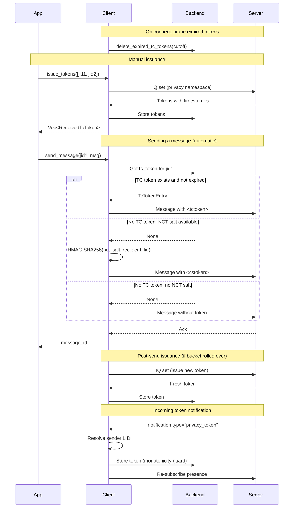

The `TcToken` feature provides APIs for issuing and managing trusted contact privacy tokens (TC tokens). These tokens are used for privacy-gated operations like sending messages and fetching profile pictures.

The library also supports **cstoken** (client-side token / NCT) as a fallback when no TC token exists for a recipient. This matches WhatsApp Web's `MsgCreateFanoutStanza.js` behavior.

Token timing (bucket duration and count) is configurable via server-side AB props, with sensible defaults matching WhatsApp Web.

## Access

Access TC token operations through the client:

```rust
let tc_token = client.tc_token();
```

## Methods

### issue_tokens

Issue privacy tokens for specified contacts.

```rust
pub async fn issue_tokens(&self, jids: &[Jid]) -> Result<Vec<ReceivedTcToken>, IqError>
```

**Parameters:**
- `jids` - Array of JIDs (should be LID JIDs) to issue tokens for

**Returns:**
- `Vec<ReceivedTcToken>` - List of received tokens

**Example:**
```rust
let jids = vec![
    "100000000000001@lid".parse()?,
    "100000000000002@lid".parse()?,
];

let tokens = client.tc_token().issue_tokens(&jids).await?;

for token in &tokens {
    println!("Token for {}: {} bytes", token.jid, token.token.len());
    println!("Timestamp: {}", token.timestamp);
}
```

<Note>
Issued tokens are automatically stored in the backend and used for subsequent operations like message sending and profile picture fetching. Tokens are also automatically issued after sending a message when the current bucket has expired (see [automatic usage](#automatic-usage)).
</Note>

### prune_expired

Remove expired tokens from storage.

```rust
pub async fn prune_expired(&self) -> Result<u32, anyhow::Error>
```

**Returns:**
- Number of tokens deleted

**Example:**
```rust
let deleted = client.tc_token().prune_expired().await?;
println!("Pruned {} expired tokens", deleted);
```

<Note>
By default, tokens expire after 28 days (4 buckets × 7 days). The server may override this via AB props. Expired tokens are also automatically pruned on connect. Call this method if you need to trigger pruning manually.
</Note>

### get

Get a stored token for a specific JID.

```rust
pub async fn get(&self, jid: &str) -> Result<Option<TcTokenEntry>, anyhow::Error>
```

**Parameters:**
- `jid` - User portion of the JID (without domain)

**Returns:**
- `Option<TcTokenEntry>` - The stored token entry, if found

**Example:**
```rust
if let Some(entry) = client.tc_token().get("100000000000001").await? {
    println!("Token timestamp: {}", entry.token_timestamp);
    println!("Token size: {} bytes", entry.token.len());
    
    if let Some(sender_ts) = entry.sender_timestamp {
        println!("Issued at: {}", sender_ts);
    }
}
```

### get_all_jids

Get all JIDs that have stored tokens.

```rust
pub async fn get_all_jids(&self) -> Result<Vec<String>, anyhow::Error>
```

**Returns:**
- List of JID user portions with stored tokens

**Example:**
```rust
let jids = client.tc_token().get_all_jids().await?;
println!("Tokens stored for {} contacts", jids.len());

for jid in jids {
    println!("  - {}", jid);
}
```

## Types

### ReceivedTcToken

Token received from the server.

```rust
pub struct ReceivedTcToken {
    /// JID the token is for
    pub jid: Jid,
    /// Binary token data
    pub token: Vec<u8>,
    /// Server timestamp
    pub timestamp: i64,
}
```

### TcTokenEntry

Stored token entry.

```rust
pub struct TcTokenEntry {
    /// Binary token data
    pub token: Vec<u8>,
    /// Token timestamp from server
    pub token_timestamp: i64,
    /// Timestamp when we issued/received this token
    pub sender_timestamp: Option<i64>,
}
```

### TcTokenConfig

Runtime-configurable timing for token expiration, sourced from server AB props.

```rust
pub struct TcTokenConfig {
    /// Receiver-side bucket duration in seconds (default: 604800 = 7 days)
    pub bucket_duration: i64,
    /// Number of receiver-side buckets (default: 4)
    pub num_buckets: i64,
    /// Sender-side bucket duration in seconds (default: 604800 = 7 days)
    pub sender_bucket_duration: i64,
    /// Number of sender-side buckets (default: 4)
    pub sender_num_buckets: i64,
}
```

The client builds this config from AB props at runtime, falling back to defaults. All values are clamped to safe ranges (durations between 1 and 180 days, counts ≥ 1).

## Automatic usage

The library automatically includes privacy tokens in outgoing 1:1 message stanzas using a fallback chain that matches WhatsApp Web:

1. **tctoken** — use the stored trusted contact token if it exists and hasn't expired
2. **cstoken** — compute an HMAC-SHA256 fallback using the NCT salt and recipient LID (for first-contact scenarios)
3. **No token** — send without a token if neither is available (the server may return a 463 error)

```rust
// TC tokens are automatically included when sending messages
client.send_message(jid, message).await?;

// And when fetching profile pictures
let picture = client.contacts().get_profile_picture(&jid, true).await?;
```

### AB prop gating

Token inclusion on message stanzas is gated by server-side AB props:

- **`PRIVACY_TOKEN_ON_ALL_1_ON_1_MESSAGES`** — controls whether tctoken/cstoken stanza children are attached to outgoing messages
- **`NCT_TOKEN_SEND_ENABLED`** — controls whether the cstoken fallback is used when no tctoken is available

Token *issuance scheduling* (requesting new tokens from the server after sending) runs regardless of these flags.

### Post-send issuance

After sending a 1:1 message, the library checks whether a new token should be issued for the recipient. If the sender-side bucket has rolled over since the last issuance, a background IQ request issues a fresh token and stores the response. This matches WhatsApp Web's `sendTcToken` behavior in `MsgJob.js`.

### Incoming token notifications

When a contact sends you a privacy token, the library handles it automatically:

1. Parses the `<notification type="privacy_token">` stanza
2. Resolves the sender to a LID for storage (using `sender_lid` attribute or LID-PN cache)
3. Applies a timestamp monotonicity guard — older tokens don't overwrite newer ones
4. Stores the token in the backend
5. Re-subscribes presence for the sender to pick up the updated token

### Startup pruning

Expired tokens are automatically pruned when the client connects, matching WhatsApp Web's `PrivacyTokenJob`.

### Skipped recipients

Tokens are not sent to:
- Your own JID
- Bot JIDs
- Status broadcast

You typically don't need to manage tokens manually unless you are:
- Pre-issuing tokens for a batch of contacts
- Debugging token-related issues

## cstoken (NCT fallback)

When no valid TC token exists for a recipient, the library falls back to a **cstoken** (client-side token). This is computed using an NCT salt that is provisioned by the server via app state sync.

### How it works

1. The server provides an NCT salt through the `nct_salt_sync` app state mutation (or via history sync during initial pairing)
2. The salt is stored in the `Device` struct as `nct_salt`
3. When sending a message to a recipient with no stored TC token, the library computes `HMAC-SHA256(nct_salt, recipient_lid)` and includes it as a `<cstoken>` stanza child

### Wire format

```xml
<!-- TC token (preferred) -->
<tctoken><!-- raw token bytes --></tctoken>

<!-- CS token (NCT fallback) -->
<cstoken><!-- HMAC-SHA256(nct_salt, recipient_lid) --></cstoken>
```

### NCT salt provisioning

The NCT salt is delivered through two channels:

- **App state sync** -- The `nct_salt_sync` mutation in the `RegularHigh` syncd collection sets or removes the salt. This is the authoritative source.
- **History sync** -- During initial pairing, the salt may be included in the history sync payload. This is a backfill-only source and won't overwrite a salt already set via app state sync.

<Note>
The cstoken fallback is fully automatic. You don't need to manage the NCT salt or compute tokens manually. The library handles salt storage, LID resolution, and token computation transparently during message sending.
</Note>

## Token lifecycle



## Expiration

TC token expiration uses a bucket-aligned system. By default, tokens expire after 28 days (4 buckets × 7-day duration). The server can override these defaults via AB props:

| AB prop | Default | Description |
| --- | --- | --- |
| `tctoken_duration` | 604800 (7 days) | Receiver-side bucket duration in seconds |
| `tctoken_num_buckets` | 4 | Number of receiver-side buckets |
| `tctoken_duration_sender` | 604800 (7 days) | Sender-side bucket duration in seconds |
| `tctoken_num_buckets_sender` | 4 | Number of sender-side buckets |

Bucket durations are capped at 180 days. The expiration cutoff is bucket-aligned — it always falls on a bucket boundary, matching WhatsApp Web's `tokenExpirationCutoff` logic.

```rust
use wacore::iq::tctoken::{tc_token_expiration_cutoff, is_tc_token_expired};

// Get the cutoff timestamp for expired tokens (using defaults)
let cutoff = tc_token_expiration_cutoff();
println!("Tokens before {} are expired", cutoff);

// Check a specific token
let expired = is_tc_token_expired(some_timestamp);

// Prune expired tokens (uses AB-prop-aware config)
let deleted = client.tc_token().prune_expired().await?;
```

## Best practices

1. **Pre-issue tokens** for contacts you frequently interact with
2. **Don't over-issue** — tokens are automatically issued after each message send when the bucket rolls over
3. **Use LID JIDs** when issuing tokens manually
4. **Let startup pruning handle cleanup** — expired tokens are pruned automatically on connect

```rust
// Pre-issue tokens for frequent contacts
async fn initialize_tokens(client: &Client, contacts: &[Jid]) -> anyhow::Result<()> {
    // Filter to LID JIDs only
    let lid_jids: Vec<_> = contacts.iter()
        .filter(|j| j.is_lid())
        .cloned()
        .collect();
    
    if !lid_jids.is_empty() {
        client.tc_token().issue_tokens(&lid_jids).await?;
    }
    
    Ok(())
}
```
