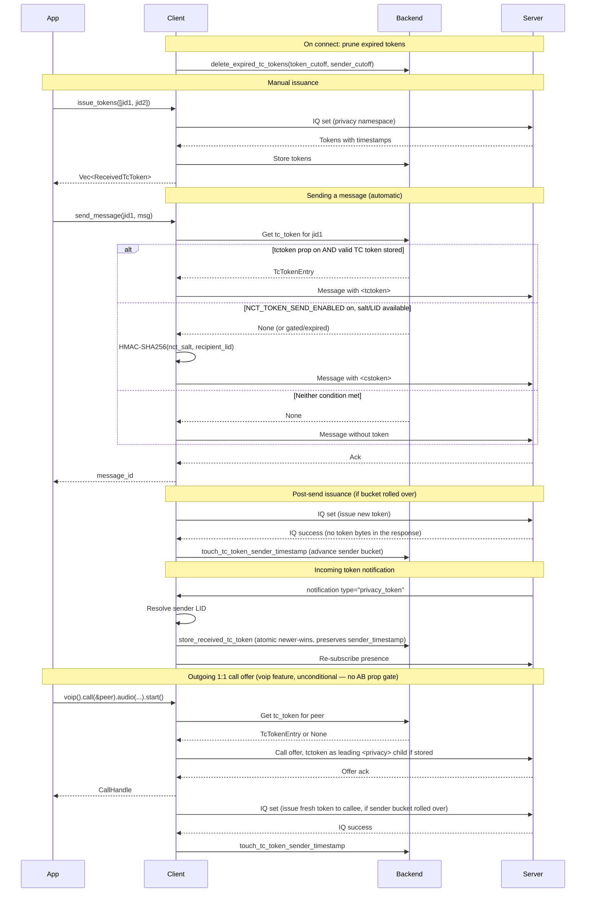

The `TcToken` feature provides APIs for issuing and managing trusted contact privacy tokens (TC tokens). These tokens are used for privacy-gated operations like sending messages and fetching profile pictures.

The library also supports **cstoken** (client-side token / NCT) as a fallback when no TC token exists for a recipient. This matches WhatsApp Web's `MsgCreateFanoutStanza.js` behavior.

Token timing (bucket duration and count) is configurable via server-side AB props, with sensible defaults matching WhatsApp Web.

## Access

Access TC token operations through the client:

```rust
let tc_token = client.tc_token();
```

## Methods

### issue_tokens

Issue privacy tokens for specified contacts.

```rust
pub async fn issue_tokens(&self, jids: &[Jid]) -> Result<Vec<ReceivedTcToken>, TcTokenError>
```

**Parameters:**
- `jids` - Array of JIDs (should be LID JIDs) to issue tokens for

**Returns:**
- `Vec<ReceivedTcToken>` - List of received tokens

**Example:**
```rust
let jids = vec![
    "100000000000001@lid".parse()?,
    "100000000000002@lid".parse()?,
];

let tokens = client.tc_token().issue_tokens(&jids).await?;

for token in &tokens {
    println!("Token for {}: {} bytes", token.jid, token.token.len());
    println!("Timestamp: {}", token.timestamp);
}
```

<Note>
Issued tokens are automatically stored in the backend and used for subsequent operations like message sending and profile picture fetching. Tokens are also automatically issued after sending a message when the current bucket has expired (see [automatic usage](#automatic-usage)).
</Note>

### prune_expired

Remove expired tokens from storage.

```rust
pub async fn prune_expired(&self) -> Result<u32, TcTokenError>
```

**Returns:**
- Number of tokens deleted

**Example:**
```rust
let deleted = client.tc_token().prune_expired().await?;
println!("Pruned {} expired tokens", deleted);
```

<Note>
By default, tokens expire after 28 days (4 buckets × 7 days). The server may override this via AB props. Expired tokens are also automatically pruned on connect. Call this method if you need to trigger pruning manually.

The received token and the sender-side issuance bucket expire on independent cutoffs — a row is only pruned once **both** are stale, so recent sender-side rate-limit state survives an expired received token (and vice versa).
</Note>

### get

Get a stored token for a specific JID.

```rust
pub async fn get(&self, jid: &str) -> Result<Option<TcTokenEntry>, TcTokenError>
```

**Parameters:**
- `jid` - User portion of the JID (without domain)

**Returns:**
- `Option<TcTokenEntry>` - The stored token entry, if found

**Example:**
```rust
if let Some(entry) = client.tc_token().get("100000000000001").await? {
    println!("Token timestamp: {}", entry.token_timestamp);
    println!("Token size: {} bytes", entry.token.len());
    
    if let Some(sender_ts) = entry.sender_timestamp {
        println!("Issued at: {}", sender_ts);
    }
}
```

### get_all_jids

Get all JIDs that have stored tokens.

```rust
pub async fn get_all_jids(&self) -> Result<Vec<String>, TcTokenError>
```

**Returns:**
- List of JID user portions with stored tokens

**Example:**
```rust
let jids = client.tc_token().get_all_jids().await?;
println!("Tokens stored for {} contacts", jids.len());

for jid in jids {
    println!("  - {}", jid);
}
```

## Error handling

Each method returns `Result<T, TcTokenError>`:

```rust
#[non_exhaustive]
pub enum TcTokenError {
    #[error("{0}")]
    Iq(#[from] IqError),
    #[error("{0}")]
    Store(#[from] StoreError),
}
```

**Variants:**
- `Iq` — the server token request failed (timeout, server error, etc.)
- `Store` — token persistence failed

**Example:**
```rust
use whatsapp_rust::TcTokenError;

let jids = vec!["100000000000001@lid".parse()?];
match client.tc_token().issue_tokens(&jids).await {
    Ok(tokens) => println!("Got {} tokens", tokens.len()),
    Err(TcTokenError::Iq(e)) => eprintln!("Server request failed: {e}"),
    Err(TcTokenError::Store(e)) => eprintln!("Storage error: {e}"),
    Err(e) => eprintln!("Error: {e}"),
}
```

## Types

### ReceivedTcToken

Token received from the server.

```rust
pub struct ReceivedTcToken {
    /// JID the token is for
    pub jid: Jid,
    /// Binary token data
    pub token: Vec<u8>,
    /// Server timestamp
    pub timestamp: i64,
}
```

### TcTokenEntry

Stored token entry.

```rust
pub struct TcTokenEntry {
    /// Binary token data
    pub token: Vec<u8>,
    /// Token timestamp from server
    pub token_timestamp: i64,
    /// Timestamp when we issued/received this token
    pub sender_timestamp: Option<i64>,
}
```

<Note>
An entry with an empty `token` is a **byte-less placeholder** — it records that a post-send issuance IQ succeeded before any real token was received from the contact. For a fresh placeholder, `token_timestamp` is set equal to `sender_timestamp` (there is no received epoch yet); since `token` is empty, the received-token side of the prune cutoff always treats the row as expired-or-absent regardless of that value, so pruning a placeholder depends only on whether `sender_timestamp` is still live. See [Post-send issuance](#post-send-issuance).
</Note>

### TcTokenConfig

Runtime-configurable timing for token expiration, sourced from server AB props.

```rust
pub struct TcTokenConfig {
    /// Receiver-side bucket duration in seconds (default: 604800 = 7 days)
    pub bucket_duration: i64,
    /// Number of receiver-side buckets (default: 4)
    pub num_buckets: i64,
    /// Sender-side bucket duration in seconds (default: 604800 = 7 days)
    pub sender_bucket_duration: i64,
    /// Number of sender-side buckets (default: 4)
    pub sender_num_buckets: i64,
}
```

The client builds this config from AB props at runtime, falling back to defaults. All values are clamped to safe ranges (durations between 1 and 180 days, counts ≥ 1).

## Automatic usage

The library automatically includes privacy tokens in outgoing 1:1 message stanzas using a fallback chain that matches WhatsApp Web:

1. **tctoken** — used when `PRIVACY_TOKEN_ON_ALL_1_ON_1_MESSAGES` is on and a stored, unexpired token exists for the recipient
2. **cstoken** — an independent HMAC-SHA256 fallback using the NCT salt and recipient LID, used when `NCT_TOKEN_SEND_ENABLED` is on and the tctoken above didn't win (its prop is off, or no valid token is stored) — see [AB prop gating](#ab-prop-gating) for the full priority logic
3. **No token** — send without a token if neither is available (the server may return a 463 error)

```rust
// TC tokens are automatically included when sending messages
client.send_message(jid, message).await?;

// And when fetching profile pictures
let picture = client.contacts().get_profile_picture(&jid, true).await?;
```

The tctoken (no cstoken fallback) is also attached automatically at three other call sites that use privacy tokens, matching WA Web's `USyncStatusProtocol`/`OutSpamTCTokenMixin`/`StartCall.js`:

- **`get_user_info`** — a per-recipient tctoken is attached to each queried `<user>` node in the usync IQ, so status/about for a privacy-restricted contact resolves instead of coming back hidden. Gated behind `profile_scraping_privacy_token_in_about_usync`.
- **`send_spam_report`** — when `SpamReportRequest::from_jid` is set, that contact's tctoken is attached to the spam report IQ so the report is accepted for a privacy-restricted account. Gated behind `enable_spam_report_iq_with_privacy_token`. Group reports that only set `group_jid`/`participant_jid` (no `from_jid`) don't get a token attached.
- **Outgoing 1:1 call offers** (`voip` feature) — placing a call attaches the callee's stored, unexpired tctoken as the offer's leading `<privacy>` node, and issues a fresh token to the callee in the background after the offer sends. This mirrors WA Web's `sendTcToken` in `StartCall.js` and prevents 463 nacks on later offers to a privacy-restricted contact. Unlike the other paths, it isn't gated by any AB prop — issuance is rate-limited only by the same sender bucket that governs message reissuance (see [Post-send issuance](#post-send-issuance)). Group-call initiation isn't implemented yet.

```rust
// Attaches the queried contact's tctoken automatically when the AB prop is on
let info = client.contacts().get_user_info(&[jid]).await?;

// Attaches the reported contact's tctoken automatically when the AB prop is on
let result = client.send_spam_report(request).await?;

// Attaches the callee's tctoken automatically, then issues a fresh one after the offer sends
let handle = client.voip().call(&peer).audio(mic_source, speaker_sink).start().await?;
```

### AB prop gating

Token inclusion on message stanzas is gated by two **independent** server-side AB props, matching WhatsApp Web's `MsgCreateFanoutStanza.js` (`Re = R(te) ?? D(te, s)`):

- **`PRIVACY_TOKEN_ON_ALL_1_ON_1_MESSAGES`** — gates the tctoken only (`R`). When off, a stored, valid tctoken is never attached.
- **`NCT_TOKEN_SEND_ENABLED`** — gates the cstoken fallback independently (`D`). The cstoken is attached whenever this flag is on and the NCT salt/recipient LID are available — **even when the tctoken prop above is off, or a valid tctoken exists but its prop is disabled**. The cstoken is not nested behind the tctoken prop.

Token *issuance scheduling* (requesting new tokens from the server after sending) runs regardless of these flags.

The usync and spam-report attachment points each have their own independent gating prop (`profile_scraping_privacy_token_in_about_usync`, `enable_spam_report_iq_with_privacy_token`) — unrelated to the message-stanza props above, and with no cstoken fallback.

Outgoing call offers (`voip` feature) attach and issue tokens **unconditionally** — there is no AB prop gate for this path at all, matching WA Web's `StartCall.js`.

### Post-send issuance

After sending a 1:1 message, the library checks whether a new token should be issued for the recipient. If the sender-side bucket has rolled over since the last issuance, a background IQ request fires.

On IQ success, the sender-side issuance timestamp is recorded **unconditionally**, matching WhatsApp Web's `sendTcToken` in `MsgJob.js`, which persists `tcTokenSenderTimestamp` on success regardless of the response body — the real `set privacy` IQ response carries no token bytes, so the timestamp can't be derived from an echoed token.

If no entry exists yet for the recipient, this creates a byte-less placeholder that carries only the sender timestamp. The placeholder is superseded by the contact's first real token (see [Incoming token notifications](#incoming-token-notifications)), regardless of the real token's own timestamp.

### Identity change reissuance

When a contact reinstalls WhatsApp and their identity key changes, the library automatically re-issues TC tokens so the contact retains a valid privacy token. This matches WhatsApp Web's `sendTcTokenWhenDeviceIdentityChange` behavior.

The reissuance is triggered when an `UntrustedIdentity` error is encountered during message decryption **from the sender's primary device (device 0)** — an identity change on a companion device does not trigger reissuance, matching WA Web. After handling the identity change (clearing the old identity and retrying decryption), the client spawns a background task that:

1. Checks if a token was previously issued to the sender (via `sender_timestamp`)
2. Verifies the token hasn't expired on the sender side
3. Re-issues the token using the original issuance timestamp to preserve the bucket window

This ensures that privacy-gated operations (like profile picture fetching) continue to work after a contact reinstalls, without requiring manual token management.

<Note>
Token reissuance is skipped for bot JIDs, status broadcast senders, and identity changes reported for non-primary (companion) devices. The operation is deduplicated via session locks to prevent concurrent reissuance for the same sender.
</Note>

### Incoming token notifications

When a contact sends you a privacy token, the library handles it automatically:

1. Parses the `<notification type="privacy_token">` stanza
2. Resolves the sender to a LID for storage (using `sender_lid` attribute or LID-PN cache)
3. Applies a timestamp monotonicity pre-filter — if the incoming token is older than a stored *real* token, storage and the presence re-subscribe are both skipped
4. Stores the token in the backend, preserving any `sender_timestamp` already recorded by the post-send issuance path
5. Re-subscribes presence for the sender to pick up the updated token

The same newer-wins rule (older writes rejected, a byte-less placeholder always accepts the first real token) is also enforced **atomically inside the store itself** — see [`store_received_tc_token`](/api/store#tctoken-storage). This is what closes the cross-source race between this notification path and history-sync's tc-token candidates: both call the same store method, so whichever call lands last can never clobber a fresher token, without needing a lock shared across the two paths.

<Note>
A byte-less placeholder (written by post-send issuance before any real token has been received) is always replaced by the contact's first real token, even if the placeholder's own timestamp is newer — the newer-wins rule only blocks a stale write once a real token is on record.
</Note>

### LID discovery migration

Tokens can arrive keyed by phone number before a contact's LID is known — for example, a token received while the peer was still PN-only. `resolve_tc_token_key` keys token lookups: it returns the LID as soon as a PN↔LID mapping exists for that contact, and the PN before that. So the moment the client learns a mapping, a token still filed under the PN becomes unreachable through this lookup — the send path then behaves as if no token had ever arrived, even though one is stored.

To prevent that, the client migrates a PN-keyed token to the LID key as part of LID discovery, alongside the device-registry and Signal-session re-keying that already happens there (see [LID-PN mappings](/concepts/storage#lid-pn-mappings)):

1. Read any token stored under the phone number
2. If found, write it under the LID — **newer-wins**, so a token already stored under the LID (e.g. from a message that arrived after the mapping was learned) is never regressed by the older PN-keyed one
3. Only after that write succeeds, delete the PN-keyed row

The newer-wins guarantee in step 2 relies on [`store_received_tc_token`](/api/store#tctoken-storage) being atomic. The built-in backends guarantee this: `SqliteStore` performs the check-and-write inside an `IMMEDIATE` transaction, and `InMemoryBackend` performs it under its state lock. A custom [`Store`](/api/store) backend that keeps the default read-modify-write implementation of that method is not protected: a concurrently-arriving LID-keyed token can land between the migration's read and write, and the migration's write would then clobber it.

The sender-side issuance timestamp isn't carried over in the migration. Normally this just means one extra post-send issuance later — but the [identity-change reissuance](#identity-change-reissuance) flow also reads `sender_timestamp` to decide whether a token was ever issued to the sender. If a contact's identity changes before the next send re-populates the timestamp, that flow sees no prior issuance and skips reissuing, rather than the token being lost outright ([#1345](https://github.com/oxidezap/whatsapp-rust/pull/1345)).

### Startup pruning

Expired tokens are automatically pruned when the client connects, matching WhatsApp Web's `PrivacyTokenJob`.

### Skipped recipients

Tokens are not sent to:
- Your own JID
- Bot JIDs
- Status broadcast

You typically don't need to manage tokens manually unless you are:
- Pre-issuing tokens for a batch of contacts
- Debugging token-related issues

## cstoken (NCT fallback)

When no valid TC token exists for a recipient, the library falls back to a **cstoken** (client-side token). This is computed using an NCT salt that is provisioned by the server via app state sync.

### How it works

1. The server provides an NCT salt through the `nct_salt_sync` app state mutation (or via history sync during initial pairing)
2. The salt is stored in the `Device` struct as `nct_salt`
3. When sending a message where the tctoken doesn't win — either `PRIVACY_TOKEN_ON_ALL_1_ON_1_MESSAGES` is off, or no valid TC token is stored — and `NCT_TOKEN_SEND_ENABLED` is on, the library computes `HMAC-SHA256(nct_salt, recipient_lid)` and includes it as a `<cstoken>` stanza child (see [AB prop gating](#ab-prop-gating) for the full priority logic)

### Wire format

```xml
<!-- TC token (preferred) -->
<tctoken><!-- raw token bytes --></tctoken>

<!-- CS token (NCT fallback) -->
<cstoken><!-- HMAC-SHA256(nct_salt, recipient_lid) --></cstoken>
```

### NCT salt provisioning

The NCT salt is delivered through two channels:

- **App state sync** -- The `nct_salt_sync` mutation in the `RegularHigh` syncd collection sets or removes the salt. This is the authoritative source.
- **History sync** -- During initial pairing, the salt may be included in the history sync payload. This is a backfill-only source and won't overwrite a salt already set via app state sync.

<Note>
The cstoken fallback is fully automatic. You don't need to manage the NCT salt or compute tokens manually. The library handles salt storage, LID resolution, and token computation transparently during message sending.
</Note>

## Token lifecycle


```mermaid
sequenceDiagram
    participant App
    participant Client
    participant Backend
    participant Server
    
    Note over Client,Server: On connect: prune expired tokens
    Client->>Backend: delete_expired_tc_tokens(token_cutoff, sender_cutoff)
    
    Note over App,Server: Manual issuance
    App->>Client: issue_tokens([jid1, jid2])
    Client->>Server: IQ set (privacy namespace)
    Server-->>Client: Tokens with timestamps
    Client->>Backend: Store tokens
    Client-->>App: Vec<ReceivedTcToken>
    
    Note over Client,Server: Sending a message (automatic)
    App->>Client: send_message(jid1, msg)
    Client->>Backend: Get tc_token for jid1
    
    alt tctoken prop on AND valid TC token stored
        Backend-->>Client: TcTokenEntry
        Client->>Server: Message with <tctoken>
    else NCT_TOKEN_SEND_ENABLED on, salt/LID available
        Backend-->>Client: None (or gated/expired)
        Client->>Client: HMAC-SHA256(nct_salt, recipient_lid)
        Client->>Server: Message with <cstoken>
    else Neither condition met
        Backend-->>Client: None
        Client->>Server: Message without token
    end
    
    Server-->>Client: Ack
    Client-->>App: message_id
    
    Note over Client,Server: Post-send issuance (if bucket rolled over)
    Client->>Server: IQ set (issue new token)
    Server-->>Client: IQ success (no token bytes in the response)
    Client->>Backend: touch_tc_token_sender_timestamp (advance sender bucket)
    
    Note over Client,Server: Incoming token notification
    Server->>Client: notification type="privacy_token"
    Client->>Client: Resolve sender LID
    Client->>Backend: store_received_tc_token (atomic newer-wins, preserves sender_timestamp)
    Client->>Server: Re-subscribe presence
    
    Note over App,Server: Outgoing 1:1 call offer (voip feature, unconditional — no AB prop gate)
    App->>Client: voip().call(&peer).audio(...).start()
    Client->>Backend: Get tc_token for peer
    Backend-->>Client: TcTokenEntry or None
    Client->>Server: Call offer, tctoken as leading <privacy> child if stored
    Server-->>Client: Offer ack
    Client-->>App: CallHandle
    Client->>Server: IQ set (issue fresh token to callee, if sender bucket rolled over)
    Server-->>Client: IQ success
    Client->>Backend: touch_tc_token_sender_timestamp
```

## Expiration

TC token expiration uses a bucket-aligned system. By default, tokens expire after 28 days (4 buckets × 7-day duration). The server can override these defaults via AB props:

| AB prop | Default | Description |
| --- | --- | --- |
| `tctoken_duration` | 604800 (7 days) | Receiver-side bucket duration in seconds |
| `tctoken_num_buckets` | 4 | Number of receiver-side buckets |
| `tctoken_duration_sender` | 604800 (7 days) | Sender-side bucket duration in seconds |
| `tctoken_num_buckets_sender` | 4 | Number of sender-side buckets |

Bucket durations are capped at 180 days. The expiration cutoff is bucket-aligned — it always falls on a bucket boundary, matching WhatsApp Web's `tokenExpirationCutoff` logic.

Pruning evaluates the received-token cutoff and the sender-bucket cutoff independently: a row is only removed once its received token is expired-or-absent **and** its sender bucket is expired-or-absent, so recent sender-side rate-limit state is never dropped just because the received token expired (and vice versa).

```rust
use wacore::iq::tctoken::{tc_token_expiration_cutoff, is_tc_token_expired};

// Get the cutoff timestamp for expired received tokens (using defaults)
let cutoff = tc_token_expiration_cutoff();
println!("Tokens before {} are expired", cutoff);

// Check a specific token
let expired = is_tc_token_expired(some_timestamp);

// Prune expired tokens — checks both the received-token and sender-bucket
// cutoffs (AB-prop-aware config); a row survives if either is still live
let deleted = client.tc_token().prune_expired().await?;
```

## Best practices

1. **Pre-issue tokens** for contacts you frequently interact with
2. **Don't over-issue** — tokens are automatically issued after each message send when the bucket rolls over
3. **Use LID JIDs** when issuing tokens manually
4. **Let startup pruning handle cleanup** — expired tokens are pruned automatically on connect

```rust
// Pre-issue tokens for frequent contacts
async fn initialize_tokens(client: &Client, contacts: &[Jid]) -> anyhow::Result<()> {
    // Filter to LID JIDs only
    let lid_jids: Vec<_> = contacts.iter()
        .filter(|j| j.is_lid())
        .cloned()
        .collect();
    
    if !lid_jids.is_empty() {
        client.tc_token().issue_tokens(&lid_jids).await?;
    }
    
    Ok(())
}
```
