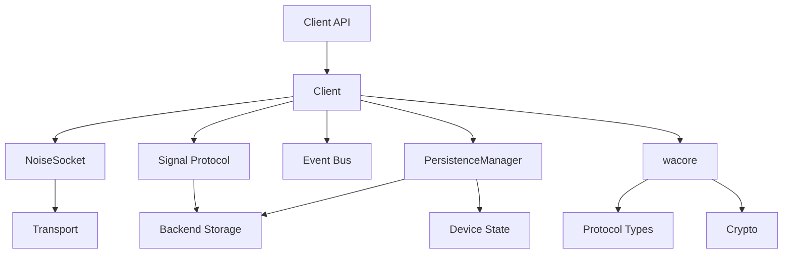
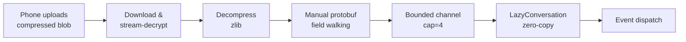
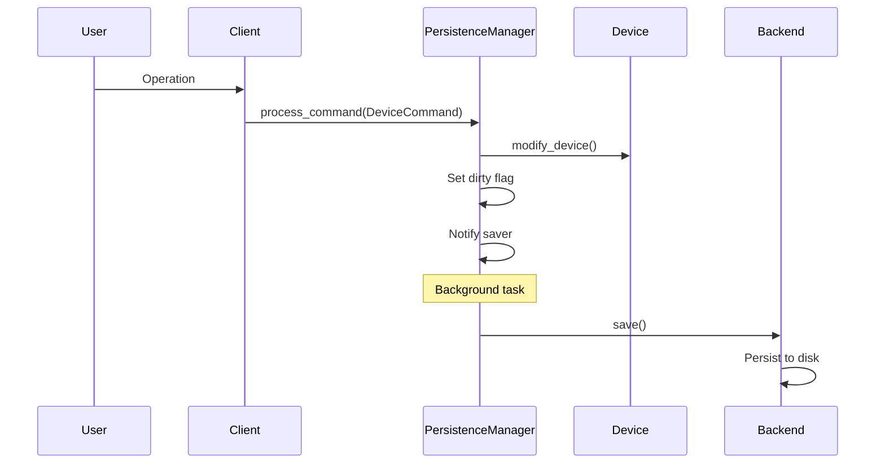

## Overview

WhatsApp-Rust is a high-performance, async Rust library for the WhatsApp Web API. The project follows a modular, layered architecture that separates protocol concerns from runtime concerns, enabling platform-agnostic core logic with pluggable backends.

## Workspace Structure

The project is organized as a Cargo workspace with multiple crates:

```
whatsapp-rust/
├── src/                          # Main client library
├── wacore/                       # Platform-agnostic core
│   ├── binary/                   # WhatsApp binary protocol
│   ├── libsignal/                # Signal Protocol implementation
│   ├── appstate/                 # App state management
│   ├── noise/                    # Noise Protocol handshake
│   └── derive/                   # Derive macros
├── waproto/                      # Protocol Buffers definitions
├── storages/sqlite-storage/      # SQLite backend
├── transports/tokio-transport/   # Tokio WebSocket transport
├── http_clients/ureq-client/     # HTTP client for media
├── tests/e2e/                    # End-to-end test suite
└── examples/                     # Example applications (benchmarks)
```

## Three Main Crates

### wacore - Platform-Agnostic Core

**Location:** `wacore/`

**Purpose:** Contains core logic for the WhatsApp binary protocol, cryptography primitives, IQ protocol types, runtime abstraction, and state management traits.

**Key Features:**
- **Zero runtime dependencies** — no Tokio, no async-std, only `futures`, `async-trait`, `async-lock`, and `async-channel`
- **32-bit target support** — uses `portable-atomic` for 64-bit atomics with a software fallback on platforms without native `AtomicU64` (ARM32, MIPS, etc.)
- `Runtime` trait for pluggable async executors (Tokio, async-std, WASM, etc.)
- `Transport`, `TransportFactory`, and `HttpClient` traits for pluggable networking
- `Backend` trait for pluggable storage
- Cryptographic operations (Signal Protocol, Noise Protocol)
- Type-safe protocol node builders

**Key Modules:**
```rust
wacore/
├── binary/           // Binary protocol encoding/decoding
├── libsignal/        // E2E encryption
├── noise/            // Noise Protocol handshake
├── appstate/         // App state sync protocol
├── derive/           // Derive macros (EmptyNode, ProtocolNode, StringEnum)
├── iq/               // Type-safe IQ protocol types
├── net.rs            // Transport, HttpClient trait definitions
├── runtime.rs        // Runtime trait + AbortHandle
├── protocol/         // ProtocolNode trait, keepalive, retry
├── time.rs           // Pluggable time provider + portable Instant
├── types/
│   ├── events.rs     // Event definitions
│   └── message.rs    // Message types
└── store/
    ├── traits.rs     // Storage trait definitions (Backend, SignalStore, etc.)
    └── device.rs     // Device state model
```

### waproto - Protocol Buffers

**Location:** `waproto/`

**Purpose:** Houses WhatsApp's Protocol Buffers definitions compiled to Rust structs.

**Build Process:**
```rust
// build.rs uses prost to compile .proto files
prost_build::compile_protos(&["src/whatsapp.proto"], &["src/"])?;
```

**Generated Types:**
- `Message` - All message types
- `WebMessageInfo` - Message metadata
- `HistorySync` - Chat history
- `SyncActionValue` - App state mutations

### whatsapp-rust - Main Client

**Location:** `src/`

**Purpose:** Integrates `wacore` with concrete implementations (Tokio runtime, SQLite storage, ureq HTTP, Tokio WebSocket), provides the high-level `Bot` builder and `Client` API.

**Key Features:**
- `TokioRuntime` — default `Runtime` implementation (gated on `tokio-runtime` feature)
- Typestate `BotBuilder` — compile-time enforcement that all 4 required components are provided
- SQLite persistence (pluggable via `Backend` trait)
- Event bus system
- Feature modules (groups, media, newsletters, communities, etc.)

## Runtime abstraction

The library is fully runtime-agnostic. All async operations go through four pluggable trait abstractions defined in `wacore`:

| Concern | Trait | Default implementation | Crate |
|---------|-------|----------------------|-------|
| Async runtime | `Runtime` | `TokioRuntime` | `whatsapp-rust` (gated on `tokio-runtime`) |
| Network transport | `TransportFactory` + `Transport` | `TokioWebSocketTransportFactory` | `whatsapp-rust-tokio-transport` |
| HTTP client | `HttpClient` | `UreqHttpClient` | `whatsapp-rust-ureq-http-client` |
| Storage | `Backend` | `SqliteStore` | `whatsapp-rust-sqlite-storage` |

The `Runtime` trait requires four methods plus one optional method with a default:

```rust
pub trait Runtime: Send + Sync + 'static {
    fn spawn(&self, future: Pin<Box<dyn Future<Output = ()> + Send + 'static>>) -> AbortHandle;
    fn sleep(&self, duration: Duration) -> Pin<Box<dyn Future<Output = ()> + Send>>;
    fn spawn_blocking(&self, f: Box<dyn FnOnce() + Send + 'static>) -> Pin<Box<dyn Future<Output = ()> + Send>>;
    fn yield_now(&self) -> Option<Pin<Box<dyn Future<Output = ()> + Send>>>;

    /// How often to yield in tight loops (every N items). Defaults to 10.
    fn yield_frequency(&self) -> u32 { 10 }
}
```

`AbortHandle` is `#[must_use]` — dropping the handle aborts the spawned task. Call `.detach()` on the handle for fire-and-forget tasks that should run to completion independently. See [custom backends — AbortHandle](/guides/custom-backends#aborthandle) for implementation details.

The `yield_frequency()` method controls how often the client cooperatively yields during tight async loops (such as processing incoming frames). It returns the number of items to process before yielding. The default value is `10`. Single-threaded runtimes should return `1` to avoid starving the event loop, while multi-threaded runtimes can use higher values or rely on `yield_now()` returning `None`.

On WASM targets, `Send` bounds are automatically removed via `#[cfg(target_arch = "wasm32")]`.

The `BotBuilder` uses a typestate pattern with four type parameters `<B, T, H, R>` (Backend, Transport, HttpClient, Runtime). The `build()` method is only callable when all four are `Provided`, making missing-component errors compile-time instead of runtime.

See [custom backends](/guides/custom-backends) for implementing your own runtime, transport, HTTP client, or storage backend.

## Key Components

### Client

**Location:** `src/client.rs`

**Purpose:** Orchestrates connection lifecycle, event bus, and high-level operations. Uses `async-lock` (runtime-agnostic) for all internal synchronization instead of Tokio-specific primitives.

```rust
pub struct Client {
    pub(crate) core: wacore::client::CoreClient,
    pub(crate) persistence_manager: Arc<PersistenceManager>,
    pub(crate) media_conn: Arc<RwLock<Option<MediaConn>>>,
    pub(crate) noise_socket: Arc<Mutex<Option<Arc<NoiseSocket>>>>,
    // ... connection state, caches, locks
}
```

**Responsibilities:**
- Connection management
- Request/response routing
- Event dispatching
- Session management

### PersistenceManager

**Location:** `src/store/persistence_manager.rs`

**Purpose:** Manages all state changes and persistence.

```rust
pub struct PersistenceManager {
    device: Arc<RwLock<Device>>,
    backend: Arc<dyn Backend>,
    dirty: Arc<AtomicBool>,
    save_notify: Arc<Notify>,
}
```

**Critical Pattern:**
- Never modify `Device` state directly
- Use `DeviceCommand` + `process_command()`
- For read-only: `get_device_snapshot()`

### Signal Protocol

**Location:** `wacore/libsignal/` & `src/store/signal*.rs`

**Purpose:** End-to-end encryption via Signal Protocol implementation.

**Features:**
- Double Ratchet algorithm
- Pre-key bundles
- Session management
- Sender keys for groups

### Socket & Handshake

**Location:** `src/socket/`, `src/handshake.rs`

**Purpose:** WebSocket connection and Noise Protocol handshake.

**Flow:**
1. WebSocket connection
2. Noise handshake (XX pattern)
3. Encrypted frame exchange

## Module Interactions



## Layer Responsibilities

### wacore Layer (Platform-Agnostic)

- Protocol logic
- State traits
- Cryptographic helpers
- Data models

**Example: IQ Protocol**
```rust
// wacore/src/iq/groups.rs
pub struct GroupQueryIq {
    group_jid: Jid,
}

impl IqSpec for GroupQueryIq {
    type Response = GroupInfoResponse;
    fn build_iq(&self) -> InfoQuery<'static> { /* ... */ }
    fn parse_response(&self, response: &NodeRef<'_>) -> Result<Self::Response> { /* ... */ }
}
```

### whatsapp-rust Layer (Runtime)

- Runtime orchestration
- Storage integration
- User-facing API

**Example: Feature API**
```rust
// src/features/groups.rs
impl<'a> Groups<'a> {
    pub async fn get_metadata(&self, jid: &Jid) -> Result<GroupMetadata> {
        // Use wacore IqSpec for protocol
        self.client.execute(GroupQueryIq::new(jid)?).await
    }
}
```

## Protocol Entry Points

### Incoming Messages

**Flow:** `src/message.rs` → Signal decryption → Event dispatch

Incoming stanzas are decoded as `Arc<OwnedNodeRef>` (zero-copy from the network buffer) and routed through per-chat message queues:

```rust
// src/message.rs
pub async fn handle_message(client: &Arc<Client>, node: &Arc<OwnedNodeRef>) {
    // 1. Extract encrypted message from NodeRef
    // 2. Decrypt via Signal Protocol
    // 3. Dispatch Event::Message
}
```

### Outgoing Messages

**Flow:** `src/send.rs` → Signal encryption → Socket send

Outgoing stanzas are built as owned `Node` values via `NodeBuilder`:

```rust
// src/send.rs
pub async fn send_message(client: &Arc<Client>, msg: &Message) {
    // 1. Encrypt via Signal Protocol
    // 2. Build protocol node (owned Node)
    // 3. Send via NoiseSocket
}
```

### Socket Communication

**Flow:** `src/socket/` → Noise framing → Transport

```rust
// src/socket/mod.rs
impl NoiseSocket {
    pub async fn send_node(&self, node: Node) -> Result<()> {
        // 1. Marshal to binary
        // 2. Encrypt with Noise
        // 3. Frame and send
    }
}
```

## Connection Lifecycle

### Auto-Reconnection

The client implements robust reconnection handling with stream error awareness:

```rust
// Client fields for connection and reconnection management
is_connected: Arc<AtomicBool>,                    // Lock-free connection state (Acquire/Release)
pub enable_auto_reconnect: Arc<AtomicBool>,       // Toggle auto-reconnect
pub auto_reconnect_errors: Arc<AtomicU32>,        // Error count for backoff
pub(crate) expected_disconnect: Arc<AtomicBool>,  // Expected vs unexpected
pub(crate) connection_generation: Arc<AtomicU64>, // Detect stale tasks
```

The `is_connected` field uses an `AtomicBool` to track whether the noise socket is established. This avoids a TOCTOU race that previously occurred when `try_lock()` on the noise socket mutex failed under contention, causing false-negative connection checks and silent ack drops.

**Connection timeout:** Both the transport connection and version fetch are wrapped in a 20-second timeout (`TRANSPORT_CONNECT_TIMEOUT`), matching WhatsApp Web's MQTT and DGW defaults. This prevents dead networks from blocking on the OS TCP SYN timeout (~60-75s). Both operations run in parallel via `tokio::join!`.

**Reconnection flow:**
1. Connection lost → `cleanup_connection_state()` (see [disconnect cleanup](#disconnect-cleanup))
2. Check `enable_auto_reconnect` → exit if disabled (401, 409, 516 disable this)
3. Check `expected_disconnect` → immediate reconnect if expected (e.g., 515)
4. Calculate Fibonacci backoff delay (1s, 1s, 2s, 3s, 5s, 8s... max 900s with +/-10% jitter)
5. Wait → attempt reconnection (with 20s connect timeout)

### Disconnect cleanup

When a connection is lost or `disconnect()` is called, `cleanup_connection_state()` resets all connection-scoped state to prevent stale data from leaking into the next connection. This cleanup runs exactly once — in the `run()` method after the message loop exits — rather than being duplicated inside the message loop on transport disconnect events:

| Resource | Action | Reason |
|----------|--------|--------|
| Transport, events, noise socket | Set to `None` | Release connection resources |
| `is_connected` | Set to `false` (Release ordering) | After socket is `None` so no task sees connected with a cleared socket |
| `chat_lanes` | Invalidated | Drop per-chat queue senders so workers exit via channel close — prevents stale workers from the old connection surviving reconnects with outdated signal/crypto state |
| `pending_retries` | Cleared | Stale keys from detached scope guard cleanup would otherwise suppress the first retry after reconnect |
| `signal_cache` | Cleared | Prevents stale signal state from leaking across connections |
| `response_waiters` | Drained | Pending IQ waiters fail fast with `InternalChannelClosed` instead of hanging until the 75s timeout |
| Offline sync state | Reset | Counters, timing, and semaphore replaced with fresh single-permit instance |
| Dead-socket timestamps | Reset to 0 | Prevents stale values from triggering an immediate reconnect on the next connection |
| `app_state_key_requests`, `app_state_syncing` | Replaced with empty maps | Prevents unbounded growth across reconnections |

<Note>
Chat lane invalidation is critical for correctness. Without it, stale message processing workers from the previous connection survive reconnects, holding outdated Signal session state that causes decryption failures on the new connection.
</Note>

**Stream error behavior:**
- **401 (unauthorized)**: Disables auto-reconnect, emits `LoggedOut`
- **409 (conflict)**: Disables auto-reconnect, emits `StreamReplaced`
- **429 (rate limited)**: Adds 5 extra Fibonacci steps to backoff, then reconnects
- **515 (expected)**: Immediate reconnect without backoff
- **516 (device removed)**: Disables auto-reconnect, emits `LoggedOut`

### Message loop (read loop)

The `read_messages_loop` runs on the `run()` caller's task and uses `select_biased!` to multiplex shutdown signals with transport events. Frame decryption is sequential (noise counter ordering), but node processing uses a hybrid inline/concurrent strategy:

- **Inline**: `success`, `failure`, `stream:error` (connection state), `message` (arrival order for per-chat queues), `ib` (offline sync tracking)
- **Spawned concurrently**: all other stanzas (receipts, notifications, presence, etc.)

After processing a batch of multiple frames, the loop refreshes `last_data_received_ms` so the keepalive loop sees the batch completion time rather than the arrival time — preventing false-positive dead-socket triggers during large offline sync batches. The loop also cooperatively yields every `yield_frequency()` frames to avoid starving other tasks.

See [WebSocket & Noise Protocol - Message loop](/advanced/websocket-handling#2-message-loop-read-loop) for implementation details.

### Keepalive loop

The keepalive loop runs as a **separate spawned task**, fully decoupled from the read loop. This ensures keepalive pings are never blocked by frame processing — even during large offline sync batches that take seconds to drain. The two loops communicate solely through atomic timestamps (`last_data_received_ms`, `last_data_sent_ms`).

```rust
const KEEP_ALIVE_INTERVAL_MIN: Duration = Duration::from_secs(15);
const KEEP_ALIVE_INTERVAL_MAX: Duration = Duration::from_secs(30);
const KEEP_ALIVE_RESPONSE_DEADLINE: Duration = Duration::from_secs(20);
const DEAD_SOCKET_TIME: Duration = Duration::from_secs(20);
```

**Behavior:**
- Sends ping every 15-30 seconds (randomized, matching WA Web's `15 * (1 + random())`)
- Skips ping if data was received within the minimum interval (connection proven alive)
- Sends ping *before* dead-socket check to prevent false-positive reconnects on idle-but-healthy connections
- Waits up to 20s for response
- Checks dead socket on **every** tick (not just after failures) — catches scenarios where pending IQs caused the ping to be skipped, or where the ping succeeded but the connection died immediately after
- Detects dead socket if no data received for 20s after a send, triggering immediate reconnection
- Fatal errors (`Socket`, `Disconnected`, `NotConnected`, `InternalChannelClosed`) cause the keepalive loop to exit immediately
- Error classification is exhaustive and compile-time enforced — adding a new error variant without handling it causes a build failure

See [WebSocket & Noise Protocol - Keepalive](/advanced/websocket-handling#keepalive-and-dead-socket-detection) for detailed keepalive internals.

### Offline sync

When reconnecting, the client tracks offline message sync progress:

```rust
pub(crate) struct OfflineSyncMetrics {
    pub active: AtomicBool,
    pub total_messages: AtomicUsize,
    pub processed_messages: AtomicUsize,
    pub start_time: Mutex<Option<wacore::time::Instant>>,
}
```

**Sync flow:**
1. Receive `<ib><offline_preview count="N"/>` → start tracking, reset counters
2. Process messages with `offline` attribute → increment counter
3. Receive `<ib><offline/>` → sync complete
4. Emit `OfflineSyncCompleted` event

**Timeout fallback:** If the server advertises offline messages via `offline_preview` but never sends the end marker (`<ib><offline/>`), the client applies a 60-second timeout (matching WhatsApp Web's `OFFLINE_STANZA_TIMEOUT_MS`). On timeout, the client logs a warning, marks sync as complete, and resumes normal operation so startup is not blocked indefinitely.

**Concurrency gating:** During offline sync, the client restricts message processing to a single concurrent task (1 semaphore permit) to preserve ordering. Once sync completes — either by the server end marker, all expected items arriving, or timeout — the semaphore is expanded to 64 permits, switching to parallel message processing.

**Semaphore transition safety:** When the semaphore is swapped from 1 to 64 permits, tasks that were already waiting on the old semaphore must not be silently dropped. The client uses a **generation-checked re-acquire loop** to handle this transition safely:

1. Each semaphore swap increments an atomic `message_semaphore_generation` counter
2. When a task acquires a permit, it checks whether the generation has changed since it started waiting
3. If the generation changed (meaning the semaphore was swapped while the task was blocked), the task drops the stale permit and re-acquires from the new semaphore
4. This loop continues until the task holds a permit from the current-generation semaphore

This prevents a critical issue where `pkmsg` messages (which carry Sender Key Distribution Messages for group chats) could be silently dropped during the offline-to-online transition. Without this safety mechanism, a dropped `pkmsg` would cause all subsequent `skmsg` messages from that sender to fail with `NoSenderKeyState`, since the SKDM they depended on was never processed.

**State reset:** On reconnect or cleanup, all offline sync state is reset (counters, timing, and the semaphore is replaced with a fresh single-permit instance) so stale state does not leak into the next connection attempt.

### Deferred device sync

During offline sync, the client may receive group messages from devices not yet present in the local device registry (for example, a companion device that was paired while the client was offline). Rather than firing a network request for each unknown device individually, the client batches these into a `PendingDeviceSync` set.

**Flow:**

1. During offline message processing, `is_from_known_device()` detects an unrecognized sender device
2. The sender's user JID is added to `PendingDeviceSync` (deduplicated — each user is queued at most once)
3. A retry receipt is sent so the sender will redeliver the message after the device list is updated
4. When `<ib><offline/>` arrives (offline sync complete), the client waits 2 seconds (`OFFLINE_DEVICE_SYNC_DELAY`, matching WhatsApp Web)
5. All batched user JIDs are flushed in a single bulk usync request via `flush_pending_device_sync()`
6. If the flush fails, the JIDs are re-enqueued for the next attempt

This batching approach minimizes network overhead — instead of N individual usync requests for N unknown devices, a single bulk request resolves all pending users.

When online (not during offline sync), unknown devices trigger an immediate background usync request instead of being batched.

```rust
// src/pending_device_sync.rs
pub(crate) struct PendingDeviceSync {
    pending: async_lock::Mutex<HashSet<Jid>>,
}
```

The `PendingDeviceSync` state is cleared on reconnect to prevent stale entries from leaking across connections.

Location: `src/pending_device_sync.rs`, `src/handlers/ib.rs`, `src/usync.rs`

See also: [Unknown device detection](/advanced/signal-protocol#unknown-device-detection) for the detection mechanism during group message decryption.

## History Sync Pipeline

History sync transfers chat history from the phone to the linked device. The pipeline is designed for minimal RAM usage through a multi-layered zero-copy strategy.

### Processing flow



### RAM optimization layers

1. **Heuristic pre-allocation with `compressed_size_hint`** — the decompression buffer is pre-allocated using a 4x multiplier on the compressed blob's `file_length` (clamped to 256 bytes – 8 MiB). When the notification provides `file_length`, this avoids repeated `Vec` reallocation during decompression. The hint comes from the decrypted (but still compressed) blob size, which is a better estimate than the encrypted size that includes MAC/padding overhead
2. **Immediate drop of compressed data** — after decompression, the compressed input is dropped so peak memory equals `max(compressed, decompressed)` rather than both combined
3. **Hand-rolled protobuf parser** — instead of decoding the entire `HistorySync` message tree (which allocates every nested message), the core walks varint tags manually and only extracts field 2 (conversations) and field 7 (pushnames)
4. **`Bytes` zero-copy slicing** — decompressed data is wrapped in a reference-counted `Bytes` buffer; each conversation is extracted as `buf.slice(pos..end)`, which is an Arc refcount increment with no per-conversation heap allocation
5. **Bounded channel streaming** — an `async_channel::bounded::<Bytes>(4)` streams conversation bytes from the blocking parser thread to the async event dispatcher, providing backpressure with only ~4 conversations in-flight
6. **`LazyConversation` wrapper** — raw `Bytes` are wrapped without parsing; protobuf decoding only happens if the event handler calls `.get()` or `.conversation()`. Each clone parses independently (plain `OnceLock`, not `Arc`-wrapped) since the common case is a single handler. On first parse, embedded messages are immediately cleared and shrunk to reclaim memory. Consumers that need message history can use `.raw_bytes()` to access the raw protobuf bytes for custom decoding, or `.get_with_messages()` for a convenience method that returns a fresh (uncached) decode with the full `WebMessageInfo` array intact
7. **Compile-time callback elimination** — when no event handlers are registered, the callback is `None`, causing the parser to skip conversation extraction entirely at the protobuf level

### Skip mode

For bots that don't need chat history, `skip_history_sync()` sends a receipt so the phone stops retrying uploads but downloads nothing. See [Bot - History Sync](/api/bot#history-sync).

## Concurrency Patterns

### Per-Chat Lanes

Prevents race conditions where a later message is processed before the PreKey message. Each chat gets a lane combining an enqueue lock and a bounded channel (capacity **500** messages) into a single cached entry, providing backpressure to prevent memory amplification when many chats are active simultaneously:

```rust
pub(crate) chat_lanes: Cache<Jid, ChatLane>,
// ChatLane { enqueue_lock, queue_tx }
// Each queue: async_channel::bounded::<Arc<OwnedNodeRef>>(500)
```

### Per-Device Session Locks

Prevents concurrent Signal protocol operations on the same session. Each device JID gets its own lock, keyed by protocol address strings generated by `to_protocol_address_string()` (format: `user[:device]@server.0`):

```rust
pub(crate) session_locks: Cache<String, Arc<async_lock::Mutex<()>>>,
// Key examples: "5511999887766@c.us.0", "123456789:33@lid.0"
```

The DM send path resolves all known recipient devices and own companion devices from the local device registry, filters out hosted devices, excludes the sender device, and deduplicates for self-DMs — matching WA Web's `WAWebSendUserMsgJob` and `WAWebDBDeviceListFanout` behavior. The local registry is checked first; a network fetch is only triggered on a cache miss to avoid unnecessary LID-migration side effects. Session locks are acquired for all involved devices in sorted order to prevent deadlocks. The `build_session_lock_keys()` helper resolves encryption JIDs (normalizing the recipient to bare form via `to_non_ad()`), sorts by `(server, user, device)` using `cmp_for_lock_order()`, and deduplicates. The `session_mutexes_for()` helper then converts the sorted JIDs to session mutexes, reusing a single `String` buffer to avoid per-JID heap allocations.

The peer message path (single-device) acquires a single lock for the resolved encryption JID. Group messages do not hold client-level session locks — each participant device is encrypted separately inside `prepare_group_stanza`. Group stanza preparation uses `sort_dedup_by_user()` to deduplicate participants before device resolution, and `sort_dedup_by_device()` to deduplicate resolved device JIDs after LID conversion — both operate in-place on sorted `Vec<Jid>` without `HashSet` allocations.

### Background Saver

Periodic persistence with dirty flag optimization:

```rust
impl PersistenceManager {
    pub fn run_background_saver(self: Arc<Self>, runtime: Arc<dyn Runtime>, interval: Duration) {
        runtime.spawn(Box::pin(async move {
            loop {
                // Wait for notification or interval
                self.save_to_disk().await;
            }
        }));
    }
}
```

## Feature Organization

**Location:** `src/features/`

```
features/
├── mod.rs              // Feature exports
├── blocking.rs         // Block/unblock contacts
├── chat_actions.rs     // Archive, pin, mute, star
├── chatstate.rs        // Typing indicators
├── community.rs        // Community management
├── contacts.rs         // Contact operations
├── groups.rs           // Group management
├── media_reupload.rs   // Media re-upload for retry
├── mex.rs              // GraphQL MEX queries
├── newsletter.rs       // Newsletter/channel operations
├── polls.rs            // Poll creation and voting
├── presence.rs         // Presence updates
├── profile.rs          // Profile management
├── signal.rs           // Signal protocol feature operations
├── status.rs           // Status updates
└── tctoken.rs          // Trusted contact tokens
```

Media upload and download operations are in `src/download.rs` and `src/upload.rs` as separate top-level modules.

**Pattern:** Features are accessed through accessor methods on `Client`:
```rust
// Access features through the client
let metadata = client.groups().get_metadata(&group_jid).await?;
let result = client.groups().create_group(options).await?;
client.presence().set_available().await?;
```

## State Management Flow



## Best Practices

### State Management

<CodeGroup>
```rust ✅ Correct
// Use DeviceCommand for state changes
client.persistence_manager
    .process_command(DeviceCommand::SetPushName(name))
    .await;
```

```rust ❌ Wrong
// Never modify Device directly
let mut device = client.device.write().await;
device.push_name = name; // DON'T DO THIS
```
</CodeGroup>

### Async Operations

<CodeGroup>
```rust ✅ Correct
// Wrap blocking I/O in spawn_blocking
let result = tokio::task::spawn_blocking(move || {
    // Heavy crypto or blocking HTTP
    expensive_operation()
}).await?;
```

```rust ❌ Wrong
// Never block the async runtime
let result = expensive_operation(); // Stalls all tasks
```
</CodeGroup>

### Error Handling

```rust
use thiserror::Error;
use anyhow::Result;

#[derive(Debug, Error)]
pub enum SocketError {
    #[error("connection closed")]
    Closed,
    #[error("encryption failed: {0}")]
    Encryption(String),
}

// Use anyhow::Result for functions with multiple error types
pub async fn complex_operation() -> Result<()> {
    // Automatically converts errors with ?
    socket_operation()?;
    storage_operation()?;
    Ok(())
}
```

## Related Sections

<CardGroup cols={2}>
  <Card title="Authentication" icon="key" href="/concepts/authentication">
    Learn about QR code and pair code flows
  </Card>
  <Card title="Events" icon="bolt" href="/concepts/events">
    Understand the event system and handlers
  </Card>
  <Card title="Storage" icon="database" href="/concepts/storage">
    Explore storage backends and state management
  </Card>
  <Card title="Getting Started" icon="rocket" href="/quickstart">
    Build your first WhatsApp bot
  </Card>
</CardGroup>