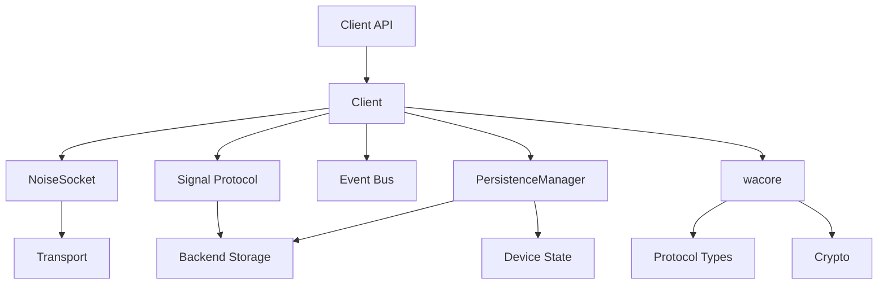
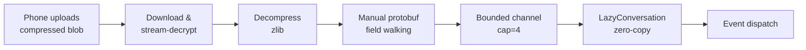
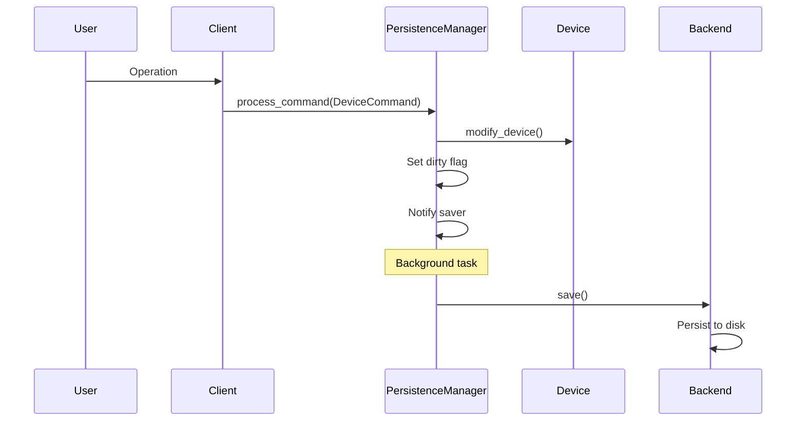

## Overview

WhatsApp-Rust is a high-performance, async Rust library for the WhatsApp Web API. The project follows a modular, layered architecture that separates protocol concerns from runtime concerns, enabling platform-agnostic core logic with pluggable backends.

## Workspace Structure

The project is organized as a Cargo workspace with multiple crates:

```
whatsapp-rust/
├── src/                          # Main client library
├── wacore/                       # Platform-agnostic core
│   ├── binary/                   # WhatsApp binary protocol
│   ├── libsignal/                # Signal Protocol implementation
│   ├── appstate/                 # App state management
│   ├── noise/                    # Noise Protocol handshake
│   └── derive/                   # Derive macros
├── waproto/                      # Protocol Buffers definitions
├── storages/sqlite-storage/      # SQLite backend
├── transports/tokio-transport/   # Tokio WebSocket transport
└── http_clients/ureq-client/     # HTTP client for media
```

## Three Main Crates

### wacore - Platform-Agnostic Core

**Location:** `wacore/`

**Purpose:** Contains core logic for the WhatsApp binary protocol, cryptography primitives, IQ protocol types, and state management traits.

**Key Features:**
- **No runtime dependencies** on Tokio or specific databases
- Pure protocol implementation
- Cryptographic operations (Signal Protocol, Noise Protocol)
- Type-safe protocol node builders

**Key Modules:**
```rust
wacore/
├── binary/           // Binary protocol encoding/decoding
├── libsignal/        // E2E encryption
├── noise/            // Noise Protocol handshake
├── appstate/         // App state sync protocol
├── iq/               // Type-safe IQ protocol types
├── protocol.rs       // ProtocolNode trait
├── types/
│   ├── events.rs     // Event definitions
│   └── message.rs    // Message types
└── store/
    ├── traits.rs     // Storage trait definitions
    └── device.rs     // Device state model
```

### waproto - Protocol Buffers

**Location:** `waproto/`

**Purpose:** Houses WhatsApp's Protocol Buffers definitions compiled to Rust structs.

**Build Process:**
```rust
// build.rs uses prost to compile .proto files
prost_build::compile_protos(&["src/whatsapp.proto"], &["src/"])?;
```

**Generated Types:**
- `Message` - All message types
- `WebMessageInfo` - Message metadata
- `HistorySync` - Chat history
- `SyncActionValue` - App state mutations

### whatsapp-rust - Main Client

**Location:** `src/`

**Purpose:** Integrates `wacore` with the Tokio runtime, provides high-level client API, and manages storage.

**Key Features:**
- Asynchronous operations with Tokio
- SQLite persistence (pluggable)
- Event bus system
- Feature modules (groups, media, etc.)

## Key Components

### Client

**Location:** `src/client.rs`

**Purpose:** Orchestrates connection lifecycle, event bus, and high-level operations.

```rust
pub struct Client {
    pub(crate) core: wacore::client::CoreClient,
    pub(crate) persistence_manager: Arc<PersistenceManager>,
    pub(crate) media_conn: Arc<RwLock<Option<MediaConn>>>,
    pub(crate) noise_socket: Arc<Mutex<Option<Arc<NoiseSocket>>>>,
    // ... connection state, caches, locks
}
```

**Responsibilities:**
- Connection management
- Request/response routing
- Event dispatching
- Session management

### PersistenceManager

**Location:** `src/store/persistence_manager.rs`

**Purpose:** Manages all state changes and persistence.

```rust
pub struct PersistenceManager {
    device: Arc<RwLock<Device>>,
    backend: Arc<dyn Backend>,
    dirty: Arc<AtomicBool>,
    save_notify: Arc<Notify>,
}
```

**Critical Pattern:**
- Never modify `Device` state directly
- Use `DeviceCommand` + `process_command()`
- For read-only: `get_device_snapshot()`

### Signal Protocol

**Location:** `wacore/libsignal/` & `src/store/signal*.rs`

**Purpose:** End-to-end encryption via Signal Protocol implementation.

**Features:**
- Double Ratchet algorithm
- Pre-key bundles
- Session management
- Sender keys for groups

### Socket & Handshake

**Location:** `src/socket/`, `src/handshake.rs`

**Purpose:** WebSocket connection and Noise Protocol handshake.

**Flow:**
1. WebSocket connection
2. Noise handshake (XX pattern)
3. Encrypted frame exchange

## Module Interactions



## Layer Responsibilities

### wacore Layer (Platform-Agnostic)

- Protocol logic
- State traits
- Cryptographic helpers
- Data models

**Example: IQ Protocol**
```rust
// wacore/src/iq/groups.rs
pub struct GroupQueryIq {
    group_jid: Jid,
}

impl IqSpec for GroupQueryIq {
    type Response = GroupInfoResponse;
    fn build_iq(&self) -> InfoQuery<'static> { /* ... */ }
    fn parse_response(&self, response: &Node) -> Result<Self::Response> { /* ... */ }
}
```

### whatsapp-rust Layer (Runtime)

- Runtime orchestration
- Storage integration
- User-facing API

**Example: Feature API**
```rust
// src/features/groups.rs
impl Client {
    pub async fn get_group_info(&self, jid: &Jid) -> Result<GroupInfoResponse> {
        self.execute(GroupQueryIq::new(jid)).await
    }
}
```

## Protocol Entry Points

### Incoming Messages

**Flow:** `src/message.rs` → Signal decryption → Event dispatch

```rust
// src/message.rs
pub async fn handle_message(client: &Arc<Client>, node: &Node) {
    // 1. Extract encrypted message
    // 2. Decrypt via Signal Protocol
    // 3. Dispatch Event::Message
}
```

### Outgoing Messages

**Flow:** `src/send.rs` → Signal encryption → Socket send

```rust
// src/send.rs
pub async fn send_message(client: &Arc<Client>, msg: &Message) {
    // 1. Encrypt via Signal Protocol
    // 2. Build protocol node
    // 3. Send via NoiseSocket
}
```

### Socket Communication

**Flow:** `src/socket/` → Noise framing → Transport

```rust
// src/socket/mod.rs
impl NoiseSocket {
    pub async fn send_node(&self, node: Node) -> Result<()> {
        // 1. Marshal to binary
        // 2. Encrypt with Noise
        // 3. Frame and send
    }
}
```

## Connection Lifecycle

### Auto-Reconnection

The client implements robust reconnection handling with stream error awareness:

```rust
// Client fields for reconnection management
pub enable_auto_reconnect: Arc<AtomicBool>,      // Toggle auto-reconnect
pub auto_reconnect_errors: Arc<AtomicU32>,        // Error count for backoff
pub(crate) expected_disconnect: Arc<AtomicBool>,  // Expected vs unexpected
pub(crate) connection_generation: Arc<AtomicU64>, // Detect stale tasks
```

**Reconnection flow:**
1. Connection lost → `cleanup_connection_state()`
2. Check `enable_auto_reconnect` → exit if disabled (401, 409, 516 disable this)
3. Check `expected_disconnect` → immediate reconnect if expected (e.g., 515)
4. Calculate Fibonacci backoff delay (1s, 1s, 2s, 3s, 5s, 8s... max 900s with +/-10% jitter)
5. Wait → attempt reconnection

**Stream error behavior:**
- **401 (unauthorized)**: Disables auto-reconnect, emits `LoggedOut`
- **409 (conflict)**: Disables auto-reconnect, emits `StreamReplaced`
- **429 (rate limited)**: Adds 5 extra Fibonacci steps to backoff, then reconnects
- **515 (expected)**: Immediate reconnect without backoff
- **516 (device removed)**: Disables auto-reconnect, emits `LoggedOut`

### Keepalive Loop

Monitors connection health with periodic pings, matching WhatsApp Web's keepalive protocol:

```rust
const KEEP_ALIVE_INTERVAL_MIN: Duration = Duration::from_secs(15);
const KEEP_ALIVE_INTERVAL_MAX: Duration = Duration::from_secs(30);
const KEEP_ALIVE_RESPONSE_DEADLINE: Duration = Duration::from_secs(20);
const DEAD_SOCKET_TIME: Duration = Duration::from_secs(20);
```

**Behavior:**
- Sends ping every 15-30 seconds (randomized, matching WA Web's `15 * (1 + random())`)
- Skips ping if data was received within the minimum interval (connection proven alive)
- Sends ping *before* dead-socket check to prevent false-positive reconnects on idle-but-healthy connections
- Waits up to 20s for response
- Detects dead socket if no data received for 20s after a send, triggering immediate reconnection
- Fatal errors (`Socket`, `Disconnected`, `NotConnected`, `InternalChannelClosed`) cause the keepalive loop to exit immediately
- Error classification is exhaustive and compile-time enforced — adding a new error variant without handling it causes a build failure

See [WebSocket & Noise Protocol - Keepalive](/advanced/websocket-handling#keepalive-and-dead-socket-detection) for detailed keepalive internals.

### Offline sync

When reconnecting, the client tracks offline message sync progress:

```rust
pub(crate) struct OfflineSyncMetrics {
    pub active: AtomicBool,
    pub total_messages: AtomicUsize,
    pub processed_messages: AtomicUsize,
    pub start_time: Mutex<Option<Instant>>,
}
```

**Sync flow:**
1. Receive `<ib><offline_preview count="N"/>` → start tracking, reset counters
2. Process messages with `offline` attribute → increment counter
3. Receive `<ib><offline/>` → sync complete
4. Emit `OfflineSyncCompleted` event

**Timeout fallback:** If the server advertises offline messages via `offline_preview` but never sends the end marker (`<ib><offline/>`), the client applies a 60-second timeout (matching WhatsApp Web's `OFFLINE_STANZA_TIMEOUT_MS`). On timeout, the client logs a warning, marks sync as complete, and resumes normal operation so startup is not blocked indefinitely.

**Concurrency gating:** During offline sync, the client restricts message processing to a single concurrent task (1 semaphore permit) to preserve ordering. Once sync completes — either by the server end marker, all expected items arriving, or timeout — the semaphore is expanded to 64 permits, switching to parallel message processing.

**State reset:** On reconnect or cleanup, all offline sync state is reset (counters, timing, and the semaphore is replaced with a fresh single-permit instance) so stale state does not leak into the next connection attempt.

## History Sync Pipeline

History sync transfers chat history from the phone to the linked device. The pipeline is designed for minimal RAM usage through a multi-layered zero-copy strategy.

### Processing flow



### RAM optimization layers

1. **Immediate drop of compressed data** — after decompression, the compressed input is dropped so peak memory equals `max(compressed, decompressed)` rather than both combined
2. **Hand-rolled protobuf parser** — instead of decoding the entire `HistorySync` message tree (which allocates every nested message), the core walks varint tags manually and only extracts field 2 (conversations) and field 7 (pushnames)
3. **`Bytes` zero-copy slicing** — decompressed data is wrapped in a reference-counted `Bytes` buffer; each conversation is extracted as `buf.slice(pos..end)`, which is an Arc refcount increment with no per-conversation heap allocation
4. **Bounded channel streaming** — a `tokio::sync::mpsc::channel::<Bytes>(4)` streams conversation bytes from the blocking parser thread to the async event dispatcher, providing backpressure with only ~4 conversations in-flight
5. **`LazyConversation` wrapper** — raw `Bytes` are wrapped without parsing; protobuf decoding only happens if the event handler calls `.get()` or `.conversation()`. On first parse, embedded messages are immediately cleared and shrunk to reclaim memory
6. **Compile-time callback elimination** — when no event handlers are registered, the callback is `None`, causing the parser to skip conversation extraction entirely at the protobuf level

### Skip mode

For bots that don't need chat history, `skip_history_sync()` sends a receipt so the phone stops retrying uploads but downloads nothing. See [Bot - History Sync](/api/bot#history-sync).

## Concurrency Patterns

### Per-Chat Message Queues

Prevents race conditions where a later message is processed before the PreKey message:

```rust
pub(crate) message_queues: Cache<String, mpsc::Sender<Arc<Node>>>,
```

### Per-Device Session Locks

Prevents concurrent Signal protocol operations on the same session:

```rust
pub(crate) session_locks: Cache<String, Arc<tokio::sync::Mutex<()>>>,
```

### Background Saver

Periodic persistence with dirty flag optimization:

```rust
impl PersistenceManager {
    pub fn run_background_saver(self: Arc<Self>, interval: Duration) {
        tokio::spawn(async move {
            loop {
                // Wait for notification or interval
                self.save_to_disk().await;
            }
        });
    }
}
```

## Feature Organization

**Location:** `src/features/`

```
features/
├── mod.rs              // Feature exports
├── groups.rs           // Group management
├── presence.rs         // Presence updates
├── media.rs            // Media upload/download
└── contacts.rs         // Contact operations
```

**Pattern:**
```rust
impl Client {
    /// High-level feature method
    pub async fn create_group(&self, subject: &str, participants: &[Jid]) -> Result<Jid> {
        // Use wacore IqSpec for protocol
        let spec = CreateGroupIq::new(subject, participants)?;
        self.execute(spec).await
    }
}
```

## State Management Flow



## Best Practices

### State Management

<CodeGroup>
```rust ✅ Correct
// Use DeviceCommand for state changes
client.persistence_manager
    .process_command(DeviceCommand::SetPushName(name))
    .await;
```

```rust ❌ Wrong
// Never modify Device directly
let mut device = client.device.write().await;
device.push_name = name; // DON'T DO THIS
```
</CodeGroup>

### Async Operations

<CodeGroup>
```rust ✅ Correct
// Wrap blocking I/O in spawn_blocking
let result = tokio::task::spawn_blocking(move || {
    // Heavy crypto or blocking HTTP
    expensive_operation()
}).await?;
```

```rust ❌ Wrong
// Never block the async runtime
let result = expensive_operation(); // Stalls all tasks
```
</CodeGroup>

### Error Handling

The library uses a layered error system with typed errors for specific domains and `anyhow::Result` for functions with multiple error sources.

#### Socket Errors

```rust
use thiserror::Error;

#[derive(Debug, Error)]
pub enum SocketError {
    #[error("Socket is closed")]
    SocketClosed,
    #[error("Noise handshake failed: {0}")]
    NoiseHandshake(String),
    #[error("I/O error: {0}")]
    Io(#[from] std::io::Error),
    #[error("Crypto error: {0}")]
    Crypto(String),
}
```

#### Encrypt/Send Errors

For detailed error recovery during message sending:

```rust
#[derive(Debug, Error)]
pub enum EncryptSendErrorKind {
    #[error("cryptography error")]
    Crypto,
    #[error("framing error")]
    Framing,
    #[error("transport error")]
    Transport,
    #[error("tokio join error")]
    Join,
    #[error("sender channel closed")]
    ChannelClosed,
}

#[derive(Debug, Error)]
#[error("{kind}")]
pub struct EncryptSendError {
    pub kind: EncryptSendErrorKind,
    #[source]
    pub source: anyhow::Error,
    pub plaintext_buf: Vec<u8>,  // Recover original data
    pub out_buf: Vec<u8>,
}
```

#### Signal Protocol Errors

Comprehensive typed errors for cryptographic operations:

```rust
#[derive(Debug, Error)]
pub enum SignalProtocolError {
    #[error("invalid argument: {0}")]
    InvalidArgument(String),
    #[error("session with {0} not found")]
    SessionNotFound(ProtocolAddress),
    #[error("untrusted identity for address {0}")]
    UntrustedIdentity(ProtocolAddress),
    #[error("message with old counter {0} / {1}")]
    DuplicatedMessage(u32, u32),
    #[error("invalid {0:?} message: {1}")]
    InvalidMessage(CiphertextMessageType, &'static str),
    // ... additional variants
}
```

#### Storage Errors

```rust
#[derive(Debug, Error)]
pub enum StoreError {
    #[error("I/O error: {0}")]
    Io(#[from] std::io::Error),
    #[error("Serialization/deserialization error: {0}")]
    Serialization(String),
    #[error("Item not found: {0}")]
    NotFound(String),
    #[error("Database backend error: {0}")]
    Backend(#[from] Box<dyn std::error::Error + Send + Sync>),
    #[error("Database connection error: {0}")]
    Connection(String),
    #[error("Database operation error: {0}")]
    Database(String),
    #[error("Migration error: {0}")]
    Migration(String),
    #[error("Device with ID {0} not found")]
    DeviceNotFound(i32),
}

// Helper for converting errors
pub fn db_err<E: std::fmt::Display>(e: E) -> StoreError {
    StoreError::Database(e.to_string())
}
```

#### Using anyhow for Multi-Error Functions

```rust
use anyhow::Result;

// Use anyhow::Result for functions with multiple error types
pub async fn complex_operation() -> Result<()> {
    // Automatically converts errors with ?
    socket_operation()?;
    storage_operation()?;
    Ok(())
}
```

## Related Sections

<CardGroup cols={2}>
  <Card title="Authentication" icon="key" href="/concepts/authentication">
    Learn about QR code and pair code flows
  </Card>
  <Card title="Events" icon="bolt" href="/concepts/events">
    Understand the event system and handlers
  </Card>
  <Card title="Storage" icon="database" href="/concepts/storage">
    Explore storage backends and state management
  </Card>
  <Card title="Getting Started" icon="rocket" href="/quickstart">
    Build your first WhatsApp bot
  </Card>
</CardGroup>