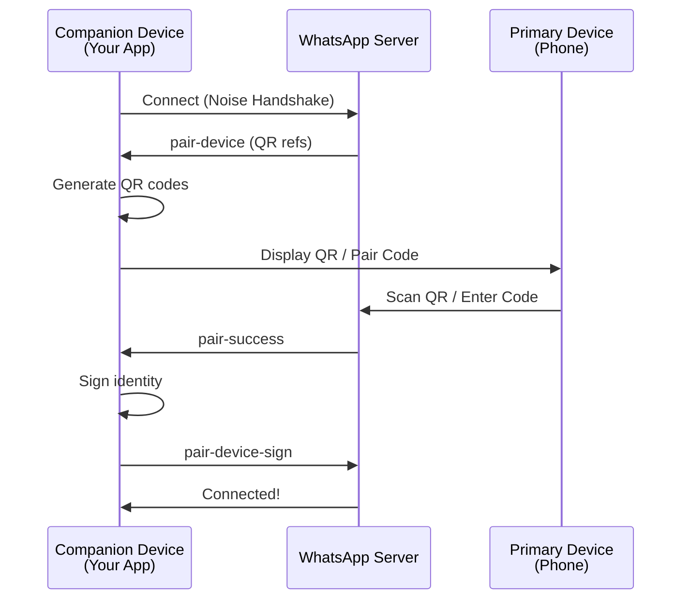
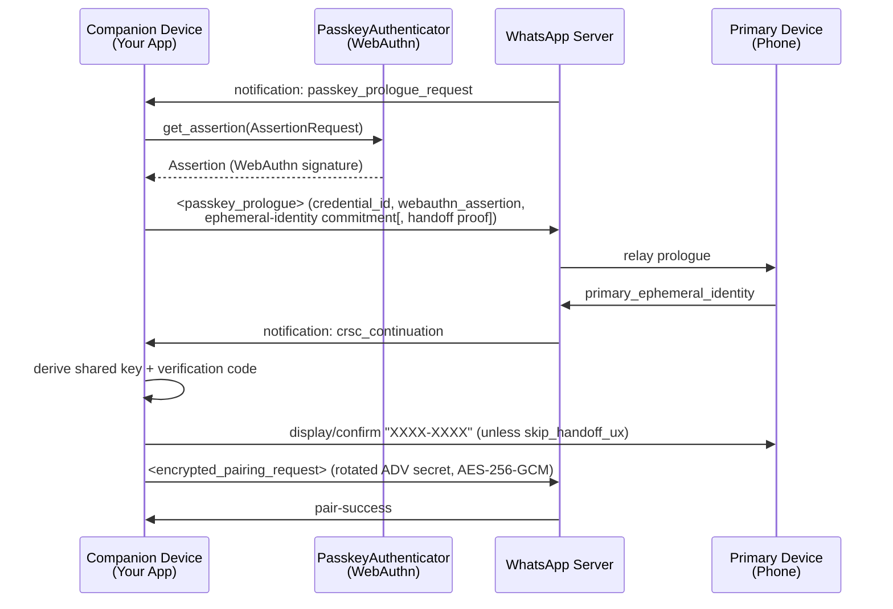

## Overview

WhatsApp-Rust supports three authentication methods for linking companion devices:

1. **QR Code Pairing** - Scan a QR code with your phone
2. **Pair Code (Phone Number Linking)** - Enter an 8-character code on your phone
3. **Passkey Linking (SHORTCAKE_PASSKEY)** - Gate the link behind a WebAuthn passkey already registered to the account

All three methods use the Noise Protocol for secure key exchange (passkey linking additionally requires a WebAuthn assertion) and can run concurrently - whichever completes first wins.

## Authentication Flow



## QR code pairing

### How it works

**Location:** `src/pair.rs`, `wacore/src/pair.rs`

1. **Server sends pairing refs:** After connection, server sends `pair-device` with multiple refs
2. **Generate QR codes:** Each ref becomes a QR code containing device keys
3. **QR rotation:** First code valid for 60s, subsequent codes for 20s each
4. **Phone scans:** User scans QR with WhatsApp > Linked Devices
5. **Crypto handshake:** Noise-based key exchange establishes trust
6. **Completion:** Server sends `pair-success`, device signs identity

### QR code contents

```rust
// src/pair.rs
// Auto-derives the client type from `device_props`.
pub fn make_qr_data(store: &Device, ref_str: &str) -> String {
    let client_type = companion_web_client_type_for_props(&store.device_props);
    make_qr_data_with_client_type(store, ref_str, client_type)
}

// Use this to override the trailing client-type field explicitly.
pub fn make_qr_data_with_client_type(
    store: &Device,
    ref_str: &str,
    client_type: CompanionWebClientType,
) -> String { /* ... */ }
```

**QR Format:** `ref,noise_pub,identity_pub,adv_secret,client_type`

- `ref`: Pairing reference from server
- `noise_pub`: Static Noise public key (32 bytes, base64)
- `identity_pub`: Signal identity public key (32 bytes, base64)
- `adv_secret`: Advertisement secret key (32 bytes, base64)
- `client_type`: Single-byte [`CompanionWebClientType`](#companionwebclienttype) wire id (e.g. `1` for Chrome, `9` for `OtherWebClient`)

<Note>
  Current WhatsApp Web emits the **5-field** form (with the trailing `client_type`). The parser (`PairUtils::parse_qr_code`) still accepts the legacy 4-field string for backwards compatibility, but `make_qr_data` always produces 5 fields.
</Note>

### Implementation

```rust
use std::sync::Arc;
use whatsapp_rust::bot::Bot;
use whatsapp_rust::TokioRuntime;
use whatsapp_rust::store::SqliteStore;
use whatsapp_rust_tokio_transport::TokioWebSocketTransportFactory;
use whatsapp_rust_ureq_http_client::UreqHttpClient;
use wacore::types::events::{Event, PairingQrCode};

#[tokio::main]
async fn main() -> Result<(), Box<dyn std::error::Error>> {
    let backend = Arc::new(SqliteStore::new("whatsapp.db").await?);

    let mut bot = Bot::builder()
        .with_backend(backend)
        .with_transport_factory(TokioWebSocketTransportFactory::new())
        .with_http_client(UreqHttpClient::new())
        .with_runtime(TokioRuntime)
        .on_event(|event, _client| async move {
            match &*event {
                Event::PairingQrCode(PairingQrCode { code, timeout, .. }) => {
                    println!("Scan this QR code (valid for {}s):", timeout.as_secs());
                    println!("{}", code);
                }
                Event::PairSuccess(info) => {
                    println!("Paired as {}", info.id);
                }
                _ => {}
            }
        })
        .build()
        .await?;

    bot.run().await?.await?;
    Ok(())
}
```

### QR code events

**Event:** `Event::PairingQrCode(PairingQrCode)`

```rust
// wacore/src/types/events.rs
#[derive(Debug, Clone, Serialize, bon::Builder)]
#[non_exhaustive]
pub struct PairingQrCode {
    pub code: String,               // ASCII art QR or data string
    pub timeout: std::time::Duration, // Validity duration (60s first, 20s subsequent)
}
```

<Note>
Breaking change: `PairingQrCode` moved from inline fields on `Event::PairingQrCode { code, timeout }` to a dedicated `#[non_exhaustive]` struct sealed with a `bon` builder — `Event::PairingQrCode(PairingQrCode)`. Update `match`/`if let` patterns to destructure through the newtype (with a `..` rest), and construct via `PairingQrCode::builder().code(code).timeout(timeout).build()` instead of a struct literal.
</Note>

**Generated in:** `src/pair.rs:63-116`

The rotation loop includes a **safety guard** that checks `is_logged_in()` before emitting each QR code. This prevents stale QR events from firing after pairing completes — important for single-threaded runtimes, fast auto-pair scenarios, and mock servers where the spawned task may not be polled until after pairing succeeds.

```rust
for code in codes_clone {
    // Safety guard: pairing may complete before this task gets polled
    if client_clone.is_logged_in() {
        info!("Already logged in, stopping QR rotation.");
        return;
    }

    let timeout = if is_first {
        is_first = false;
        Duration::from_secs(60)
    } else {
        Duration::from_secs(20)
    };

    client.core.event_bus.dispatch(Event::PairingQrCode(
        PairingQrCode::builder().code(code).timeout(timeout).build(),
    ));

    let sleep = client_clone.runtime.sleep(timeout);
    let stop = stop_rx.recv();
    futures::pin_mut!(sleep);
    futures::pin_mut!(stop);
    match futures::future::select(sleep, stop).await {
        futures::future::Either::Left(_) => {
            // Timeout elapsed — check again in case login happened during sleep
            if client_clone.is_logged_in() {
                info!("Logged in during QR timeout, stopping rotation.");
                return;
            }
        }
        futures::future::Either::Right(_) => {
            info!("Pairing complete. Stopping QR code rotation.");
            return;
        }
    }
}
```

<Note>
  The rotation uses `futures::future::select` with an `async_channel` stop signal rather than Tokio-specific primitives. This keeps the QR rotation compatible with any async runtime, since the `Client` uses the pluggable `Runtime` trait for sleep and spawn operations.
</Note>

### QR ref exhaustion

The server hands out six `pair-device` refs per connection (60s for the first, 20s for each of the other five — 160s total). When the rotation runs out of refs, it dispatches [`Event::PairingQrCodesExhausted`](/concepts/events#pairingqrcodesexhausted) rather than disconnecting unconditionally:

```rust
// src/pair.rs
let pair_code_outstanding = client_clone
    .pair_code_state
    .lock()
    .await
    .is_outstanding(wacore::time::now_secs());

client_clone.core.event_bus.dispatch(Event::PairingQrCodesExhausted(
    PairingQrCodesExhausted::builder()
        .disconnected(!pair_code_outstanding)
        .build(),
));
if !pair_code_outstanding {
    client_clone.disconnect().await;
}
```

A [pair code](#pair-code-phone-number-linking) flow has an unrelated lifetime — a code sits on a phone screen for up to its ~180s validity window (and longer still while a `companion_finish` is pending), which outlasts the 160s the six QR refs buy. Disconnecting unconditionally would revoke a code the client had just told the user was still good, and any `primary_hello` for it would then arrive at a session the server had already dropped. So the client now disconnects **only when no pair-code flow is outstanding** — a QR-only consumer keeps the reconnect-for-fresh-refs behavior it relies on, while a phone-number flow in progress keeps its socket up.

<Note>
`disconnected: true` means the client is about to tear down its own socket, not that it already has: as the snippet above shows, the event dispatches *before* `disconnect().await` is called. A handler registered as a plain `EventHandler` runs inline during `dispatch`, ahead of the disconnect; a `Bot`/`on_event` closure runs off a channel on its own task and can race it either way.

Note that no [`Event::Disconnected`](/concepts/events#disconnected) follows this particular teardown: `Client::disconnect()` sets the `expected_disconnect` flag, and `Disconnected` is scoped to disconnects the client did *not* intend — so waiting on it here would hang forever. `disconnect()` also disables auto-reconnect and, as of PR #1258, is final for this `Client` instance: it fires the same sticky shutdown signal that [`connect()`](/api/client#connect) now checks on entry, so every later `connect()` call on *this* client returns `ConnectError::Shutdown`, not `AlreadyConnected` — retrying with backoff never succeeds. To resume, construct a fresh [`Client`](/api/client#creating-a-client) against the same `persistence_manager` (the not-yet-paired device state lives there) and call `connect()` on that new instance instead.
</Note>

<Note>
Breaking change: this is a new event. If you match on `Event` exhaustively with a wildcard already in place, no change is needed. Code that used to rely on the client always disconnecting when QR refs ran out — e.g. treating any disconnect during pairing as "start over" — should instead branch on `PairingQrCodesExhausted.disconnected` and reload only when it's `true`.
</Note>

### Native-camera deep link (open WhatsApp directly)

By default the `Event::PairingQrCode` `code` is the **raw** comma-separated string above. It is meant to be scanned from *inside* WhatsApp (**Linked Devices → Link a Device**) — it is **not** a URL and tapping it does nothing.

WhatsApp Web (`WAWebLinkDeviceQrcode`) also supports a **deep-link** shape for **iOS native-camera linking**: prefixing the same payload with a `wa.me` URL turns the QR into a link. On iOS, scanning it with the **native Camera app** (not the in-app scanner) opens WhatsApp straight to the Linked Devices screen and hands off the pairing payload via the URL fragment (`#...`).

The prefix is exported as a constant:

```rust
// wacore/src/companion_reg.rs (re-exported from whatsapp_rust::pair)
pub const NATIVE_CAMERA_DEEP_LINK_PREFIX: &str = "https://wa.me/settings/linked_devices#";
```

<Warning>
  `make_qr_data` and `Event::PairingQrCode` **never** add this prefix — the emitted string is always the raw 5-field payload. If you want the deep-link behavior you must prepend the prefix yourself before rendering the QR. `PairUtils::parse_qr_code` transparently strips the prefix, so the raw and deep-link forms are interchangeable on the scanning side.
</Warning>

#### Mini example — render a scannable deep-link QR

```rust
use whatsapp_rust::pair::NATIVE_CAMERA_DEEP_LINK_PREFIX;
use wacore::types::events::{Event, PairingQrCode};

// Depends on the `qrcode` crate:  qrcode = "0.14"
fn render_qr(payload: &str) {
    use qrcode::{QrCode, render::unicode};
    let code = QrCode::new(payload).expect("valid QR payload");
    let art = code
        .render::<unicode::Dense1x2>()
        .quiet_zone(true)
        .build();
    println!("{art}");
}

// ...inside your event handler:
.on_event(|event, _client| async move {
    if let Event::PairingQrCode(PairingQrCode { code, timeout, .. }) = &*event {
        // Prepend the prefix so iOS's native Camera opens WhatsApp directly.
        let deep_link = format!("{NATIVE_CAMERA_DEEP_LINK_PREFIX}{code}");

        println!("Scan with your iOS Camera app (valid {}s):", timeout.as_secs());
        render_qr(&deep_link);

        // Tip: `deep_link` is also a working https:// URL you can share as a
        // clickable link on the device itself.
    }
})
```

Render the **raw** `code` instead of `deep_link` if you want the classic in-app scanner flow; both produce a valid, scannable code.

## Pair code (phone number linking)

### How it works

**Location:** `src/pair_code.rs`, `wacore/src/pair_code.rs`

1. **Generate code:** 8-character Crockford Base32 code
2. **Stage 1 - Hello:** Send phone number + encrypted ephemeral key
3. **Server response:** Returns pairing reference
4. **User enters code:** On phone: WhatsApp > Linked Devices > Link with phone number
5. **Stage 2 - Finish:** Phone confirms, companion sends key bundle
6. **Completion:** Server sends `pair-success`

### Pair code format

**Alphabet:** Crockford Base32 (excludes 0, I, O, U)
```
123456789ABCDEFGHJKLMNPQRSTVWXYZ
```

**Length:** Exactly 8 characters

**Example:** `ABCD1234`, `MYCODE12`

### Implementation

#### Random Code

```rust
use whatsapp_rust::pair_code::PairCodeOptions;

let options = PairCodeOptions {
    phone_number: "15551234567".to_string(),
    show_push_notification: true,
    ..Default::default()
};

let code = client.pair_with_code(options).await?;
println!("Enter this code on your phone: {}", code);
```

#### Custom Code

```rust
let options = PairCodeOptions {
    phone_number: "15551234567".to_string(),
    custom_code: Some("MYCODE12".to_string()),
    ..Default::default()
};

let code = client.pair_with_code(options).await?;
assert_eq!(code, "MYCODE12");
```

### One code at a time

A second code does not replace the first *for the phone*: the server routes `primary_hello` by phone number, never seeing the code itself, so whoever is still reading the older code reaches stage 2 and is handed a key bundle their code cannot open — the phone reports a failed link and the companion sees nothing. WA Web forbids the overlap outright (`invariant(stage === Initialized)` in `Alt/DeviceLinkingApi.js`).

`pair_with_code` now enforces the same rule: it fails with [`PairCodeError::CodeAlreadyOutstanding { remaining }`](#pair-code-errors) while the previous code is still outstanding, instead of silently overwriting it. "Outstanding" is either clock: the code's own validity window, or — once `primary_hello` has been accepted — the pending `pair-success` that follows it, which can run up to a minute past the window (`remaining` reads as `0` in that case, since there's no window left to report). Call `cancel_pair_code` first when the replacement is intentional:

```rust
use wacore::pair_code::PairCodeError;
use whatsapp_rust::pair_code::PairError;

match client.pair_with_code(options).await {
    Ok(code) => println!("Enter this code on your phone: {code}"),
    Err(PairError::PairCode(PairCodeError::CodeAlreadyOutstanding { remaining })) => {
        // `remaining` is the code's validity window, not a countdown on the
        // overall block: it reads `0` while a pair-success is pending on an
        // already-entered code, not "no time left before you may retry".
        eprintln!("A code is already outstanding ({remaining:?} left in its validity window) — cancel it first");
        client.cancel_pair_code().await;
    }
    Err(e) => eprintln!("Pair code request failed: {e}"),
}
```

<Note>
**Do not drive `pair_with_code` from QR-code rotation.** The two flows have unrelated lifetimes — a pair code is read off a screen and typed into a phone minutes later, well past the point a QR ref would rotate. Re-requesting a code on every QR rotation trips `CodeAlreadyOutstanding` and does not match WA Web, which only regenerates on the server's `refresh_code`, on `force_manual_refresh`, or on its own expiry timers — never on a QR ref rotating. See [Pair code refresh events](#pair-code-refresh-events) for the cases that *do* warrant a new request.
</Note>

`Client::cancel_pair_code()` abandons the outstanding flow, if any — WA Web's `initializeAltDeviceLinking()`.

```rust
// src/pair_code.rs
pub async fn cancel_pair_code(self: &Arc<Self>);
```

<Note>
**Cancellation is now reliable on both sides of `primary_hello`.** Before a `primary_hello` has been accepted, cancelling is immediate and complete: a later `primary_hello` for the cancelled ref is dropped rather than answered with a bundle its holder cannot open. Deriving the key bundle and sending `companion_finish` runs under the same lock `cancel_pair_code` takes, so the two never interleave mid-derivation — `cancel_pair_code` either runs before stage 2 starts (and the notification is dropped) or after stage 2 has already sent `companion_finish` and released the lock. In that second case, cancelling **re-mints the device's `adv_secret_key`**: the value stage 2 derived and persisted is keyed to a primary that has just been told to stop, so a `pair-success` that still arrives for it fails signature verification instead of silently completing the link. A flow already in `PairCodeState::Completed` is left untouched — that secret belongs to a device that did pair, and re-minting it would invalidate the account's own ADV signatures.
</Note>

An expired code never blocks a new request — `CodeAlreadyOutstanding` is only returned while the previous code (or a pending `pair-success` for it) is still live.

### Pair code options

```rust
// wacore/src/pair_code.rs
pub struct PairCodeOptions {
    /// Phone number in international format (e.g., "15551234567").
    /// Non-digit characters are automatically stripped.
    pub phone_number: String,

    /// Whether to show a push notification on the phone (default: `true`).
    pub show_push_notification: bool,

    /// Custom 8-character code (must be valid Crockford Base32).
    /// If `None`, a random code is generated.
    pub custom_code: Option<String>,

    /// Override for `companion_platform_id`. When `None`, the value is
    /// derived from `Device.device_props.platform_type`.
    pub platform_id: Option<CompanionWebClientType>,

    /// Advanced OS override for `companion_platform_display`. `None`
    /// (default) canonicalizes `DeviceProps::os` to a small server-safe set
    /// (an unrecognized/branding value coerces to `Linux`). `Some(os)` sends
    /// `os` **verbatim**, bypassing that coercion — use it to keep a real OS
    /// name the server accepts but the canonical set drops (e.g. `"Ubuntu"`,
    /// `"Fedora"`). At your own risk: the server rejects a non-OS string with
    /// `bad-request`. An all-whitespace value is ignored (falls back to the
    /// safe coercion).
    pub display_os: Option<String>,
}
```

### CompanionWebClientType

`CompanionWebClientType` is the wire-level enum emitted in the `<companion_platform_id>` child of the pair-code IQ. Each variant has a fixed single-byte ASCII identifier returned by [`wire_byte`](https://github.com/oxidezap/whatsapp-rust/blob/main/wacore/src/companion_reg.rs):

```rust
// wacore/src/companion_reg.rs
pub enum CompanionWebClientType {
    // Web (digit codes from WAWebCompanionRegClientUtils.DEVICE_PLATFORM)
    Chrome,            // b'1'
    Edge,              // b'2'
    Firefox,           // b'3'
    Ie,                // b'4'
    Opera,             // b'5'
    Safari,            // b'6'
    Electron,          // b'7'
    Uwp,               // b'8'
    OtherWebClient,    // b'9' — default fallback
    // Mobile (letter codes from the official WhatsApp Android client).
    // Reachable only via an explicit `PairCodeOptions::platform_id` override
    // because the server requires attestation that this crate cannot fake.
    AndroidTablet,     // b'd'
    AndroidPhone,      // b'e'
    AndroidAmbiguous,  // b'f'
}
```

The proto's `UNKNOWN` (wire `'0'`) is intentionally absent — WA Web never emits it from a real browser and the server rejects it. The default is `OtherWebClient` (`'9'`). The server accepts 23 single-byte ids (`0..9` and `a..m`); only the 12 with a confirmed platform meaning are exposed.

#### Mapping from `PlatformType`

`companion_web_client_type_for_platform` maps each `wa::device_props::PlatformType` to a wire variant. Web platforms map to their browser variant (Chrome, Firefox, Edge, etc.). `Desktop` maps to `Electron`. The Android `PlatformType` variants (`AndroidPhone`, `AndroidTablet`, `AndroidAmbiguous`) map to **`Chrome`** — that's what real WA Web on Chrome-Android emits and what the server accepts without attestation. To request the Android letter codes (`'d'`/`'e'`/`'f'`) explicitly, set `PairCodeOptions::platform_id`. iOS, AR/VR, Wear OS, `WAIL`, and the proto's `UNKNOWN` collapse to `OtherWebClient` — the Android letters need attestation this crate cannot produce, and `'0'` is server-rejected.

#### `companion_platform_display`

The display string sent in `<companion_platform_display>` is built from the resolved wire variant and a **canonicalized** OS derived from `DeviceProps::os`:

- Web variants emit `<Browser> (<OS>)`, e.g. `Chrome (Linux)`, `Firefox (Windows)`. Non-browser web variants (Electron, UWP, OtherWebClient) and Android-mapped-to-Chrome fall back to `Chrome (<OS>)`, mirroring WA Web's reported renderer name.
- Explicit `AndroidPhone`/`AndroidTablet`/`AndroidAmbiguous` overrides emit `Android (<OS>)`, e.g. `Android (Android)`.

<Warning>
  Unlike QR pairing — which never sends this field and so tolerates an arbitrary branding string in `DeviceProps::os` — the pair-code `companion_hello` server **rejects a non-OS `companion_platform_display` with `bad-request`**. The OS component is therefore canonicalized through `wacore::companion_reg::CompanionOs` into a small, server-safe set instead of using `DeviceProps::os` verbatim.
</Warning>

`CompanionOs::from_hint` classifies a free-form OS hint (case-insensitive, with whole-word guards so branding like `"KaiOS"`/`"March"`/`"across"` doesn't false-match a substring) into one of:

| `CompanionOs` | Wire string | Matches (examples) |
|---|---|---|
| `Windows` | `Windows` | `windows`, `Windows 11` |
| `MacOs` | `Mac OS` | `Mac`, `macOS`, `Mac OS X`, `darwin` |
| `Linux` | `Linux` | `Linux`, `Ubuntu`, `Fedora`, `Arch`, `Chrome OS`, `CrOS` |
| `Android` | `Android` | `Android`, `android 14` |
| `Ios` | `iOS` | `iOS`, `iPhone`, `iPad`, `iPadOS` |

An OS that doesn't classify (empty, or a branding string such as `"Veloz"`) coerces to `Linux` — the same fallback QR pairing already used for an empty OS, now also covering non-OS branding strings. The client logs a one-time `warn!` when this coercion actually changes a non-empty `os`, so a consumer sees why their custom branding didn't ride through.

**Escape hatch:** set `PairCodeOptions::display_os` to send an OS **verbatim**, bypassing canonicalization entirely — useful to keep a real, server-accepted name the canonical set collapses (e.g. `"Ubuntu"` → `Linux`). This is at the caller's risk: a non-OS string here is rejected with `bad-request`. An all-whitespace override is ignored and falls back to the safe coercion.

The server also validates that the display string is 1..=100 bytes.

### Pair code events

**Event:** `Event::PairingCode(PairingCode)`

```rust
// wacore/src/types/events.rs
#[derive(Debug, Clone, Serialize, bon::Builder)]
#[non_exhaustive]
pub struct PairingCode {
    pub code: String,               // The 8-character pairing code
    pub timeout: std::time::Duration, // Validity (~180 seconds), remaining at time of emission
}
```

**Generated in:** `src/pair_code.rs`

The validity clock (`code_generation_ts`) is stamped *before* the stage-1 `companion_hello` request is sent, matching WA Web's `startAltLinkingFlow`. Because of this, `timeout` on the dispatched event is the *remaining* window (`code_validity() - elapsed`), not always the full ~180 seconds — otherwise a UI countdown built from the event would outlast the server's (and this crate's own `handle_primary_hello`) actual expiry check by however long stage 1 took.

```rust
let code_generation_ts = wacore::time::now_secs();
// ...stage 1 companion_hello round-trip...
let elapsed = wacore::time::now_secs().saturating_sub(code_generation_ts).max(0) as u64;
let remaining = PairCodeUtils::code_validity()
    .saturating_sub(std::time::Duration::from_secs(elapsed));

self.core.event_bus.dispatch(Event::PairingCode(
    PairingCode::builder()
        .code(code.clone())
        .timeout(remaining)
        .build(),
));
```

<Note>
Breaking change: `PairingCode` and `PairingCodeRefresh` moved from inline enum-variant fields (`Event::PairingCode { code, timeout }`, `Event::PairingCodeRefresh { force_manual }`) to dedicated `#[non_exhaustive]` structs sealed with a `bon` builder — `Event::PairingCode(PairingCode)` / `Event::PairingCodeRefresh(PairingCodeRefresh)`. Destructuring patterns need a `..` rest; construction goes through `PairingCode::builder()…build()`.
</Note>

### Pair code refresh events

**Event:** `Event::PairingCodeRefresh(PairingCodeRefresh)`

```rust
// wacore/src/types/events.rs
#[derive(Debug, Clone, Serialize, bon::Builder)]
#[non_exhaustive]
pub struct PairingCodeRefresh {
    pub force_manual: bool,  // true when the server requires an explicit re-request
}
```

`PairingCodeRefresh` now covers **two** triggers, matching WA Web's `Alt/DeviceLinkingApi.js` and `Link/DevicePhoneNumberCodeScreen.react.js`:

1. **Server-requested.** A `link_code_companion_reg` notification arrives with `stage="refresh_code"` (WA Web `refreshAltLinkingCode` / `forceManualRefresh`) and its `link_code_pairing_ref` matches the outstanding request. `force_manual` reflects the notification's `force_manual_refresh` attribute.
2. **Silent `pair-success`.** The code was entered on the phone (`primary_hello` accepted), `companion_finish` was not refused — either the server accepted it, or the 30s wait for its own answer timed out unanswered — but no `pair-success` arrived within `PairCodeUtils::primary_hello_pair_success_timeout()` (WA Web's one-minute `primary_hello_expire` timer). A primary that fails to open the key bundle just goes quiet at this stage — silence is the only signal there is — so the client times the wait out itself and dispatches `PairingCodeRefresh` with `force_manual: false`.

A *refused* `companion_finish` is a different case and no longer falls under this event: the server answers with an error immediately, so the client doesn't need to wait out the silence timer to know the flow is dead. See [Pair code failure events](#pair-code-failure-events).

In both cases the outstanding flow is cleared **before** the event fires, so a handler can call [`Client::pair_with_code`](/api/client#pair_with_code) immediately without hitting [`PairCodeError::CodeAlreadyOutstanding`](#one-code-at-a-time). The previous code is no longer valid either way. Register a handler with [`Bot::on_pair_code_refresh`](/api/bot#on_pair_code_refresh) or match on the event directly via `on_event`.

### Pair code failure events

**Event:** `Event::PairingCodeError(PairingCodeError)`

```rust
// wacore/src/types/events.rs
#[derive(Debug, Clone, Serialize, bon::Builder)]
#[non_exhaustive]
pub struct PairingCodeError {
    pub rejection: Option<PairCodeRejection>,   // The server's refusal, when it answered with one
    pub backoff: Option<std::time::Duration>,   // The server's requested retry delay, when it named one
    pub error: String,                          // The failure rendered for logs — do not branch on it
}
```

The counterpart to `PairingCode` on the failure path, and the only surface that reports a failed request when pairing is driven by [`BotBuilder::with_pair_code`](/api/bot#with_pair_code): that call runs [`Client::pair_with_code`](/api/client#pair_with_code) inside a detached task, so nothing returns its `Err` to a caller. `pair_with_code` dispatches this event in addition to returning `Err`, mirroring how the success path both returns the code and emits `Event::PairingCode`. Register a handler with [`BotBuilder::on_pair_code_error`](/api/bot#on_pair_code_error) or match on the event directly via `on_event`.

Fires for **every** stage-1 failure, including local validation — a phone number that's too short never reaches the server. `rejection` carries the server's refusal as a typed status in most cases where the server answered: `Some(PairCodeRejection::Unknown(code))` even for a code outside WA Web's own five — the code is still preserved, just not aliased to a named arm. `None` means one of two things instead: the failure never reached the server at all (local validation, no connection, timeout), *or* it did, but the server paired a **named** code with a `text` that contradicts it — see [`PairCodeRejection::from_server`](#paircoderejection) for why a contradiction is refused rather than trusted. In every `None` case the message from `error` is still the only description available. A claim the failed request itself held is released before this fires, so `pair_with_code` can be called again immediately.

**Also fires for a stage-2 refusal.** Since the [Stage 2: Finish](#stage-2-finish) `companion_finish` round trip was made to wait for its answer, a server refusal there dispatches this same event — immediately, not after the minute-long `pair-success` silence timer. There is no separate event type: both round trips fail the same way for a consumer, which is that this code is finished and another has to be requested. `rejection` is classified from the same `PairCodeRejection` set stage 1 uses — WA Web's own `companion_finish` parser only ever answers with two of those codes (see [`PairCodeRejection`](#paircoderejection) below), but a server response outside that pair is still classified rather than discarded, exactly as an out-of-set stage-1 code is. An unanswered (timed-out) `companion_finish` does **not** dispatch this event; that silence is still owned by the one-minute timer and surfaces as [`PairingCodeRefresh`](#pair-code-refresh-events) instead.

Two failures do **not** dispatch this event, because for them a code may still be on its way and the event would say the opposite:

- **`PairCodeError::CodeAlreadyOutstanding`** — refused precisely because an earlier code is still live; the consumer already has it from the `PairingCode` event that minted it.
- **`PairCodeError::Cancelled`** — the caller withdrew this request via `cancel_pair_code`, and a replacement may already own the slot by the time this one resolves; reporting the withdrawn request would be uncorrelated with the flow that's actually running.

Both are consequences of something the caller did, so neither is news to them, and a direct caller still receives the `Err` either way — only the event is suppressed. `PairError::lost_the_flow_to_another_request()` is `true` for exactly these two variants.

#### PairCodeRejection

```rust
// wacore/src/pair_code.rs
pub enum PairCodeRejection {
    BadRequest,          // 400 — malformed, or throttled per phone number (server reuses this code)
    Forbidden,           // 403
    RateOverlimit,       // 429 — requesting codes too fast; the only correct response is to slow down
    FeatureNotAvailable, // 452 — phone-number linking disabled for this account; retrying will not help
    InternalServerError, // 500
    Unknown(i32),        // a code outside WA Web's own accepted set
}
```

The five named variants are the complete set WA Web's stage-1 response parser (`WASmaxInMdIqMixinErrors.parseIqMixinErrors`) accepts; anything else makes its own RPC throw "unknown error", which is what `Unknown(code)` preserves here. Classified via `PairCodeRejection::from_server(code, text)` from *both* wire attributes together — WA Web asserts them as a literal pair (e.g. `429`/`rate-overlimit`) and falls back to its generic error path when they disagree, so a contradicting `text` classifies as `None` rather than aliasing the code to the named arm. An absent `text` is not treated as a contradiction; the code alone decides in that case.

Both pair-code round trips report through this same type, though only stage 1's `companion_hello` accepts the full five. Stage 2's `companion_finish` has its own, narrower server-side parser (`WASmaxInMdCompanionFinishErrors`) that admits only `BadRequest` (400) and `InternalServerError` (500) — WA Web shows its generic failure for anything else there. A stage-2 code outside that pair is still classified here rather than discarded: what a consumer does about a refusal follows from the code, which is one namespace across both requests.

`PairCodeRejection::is_throttled()` is `true` for `RateOverlimit` and `BadRequest` — deliberately wider than the literal 429, because the server throttles pair-code requests per phone number under `bad-request` instead of `rate-overlimit`, and the two are indistinguishable on the wire. Treat a `true` here as "back off, then retry a bounded number of times," not as proof the request would eventually succeed. `FeatureNotAvailable` is never throttled — retrying cannot fix it, and WA Web falls back to the QR code instead.

`PairError` (the `Err` `pair_with_code` returns) exposes the same classification without depending on the event:

```rust
impl PairError {
    pub fn rejection(&self) -> Option<PairCodeRejection>;
    pub fn backoff(&self) -> Option<std::time::Duration>;
    pub fn lost_the_flow_to_another_request(&self) -> bool;
}
```

### Two-Stage Flow

#### Stage 1: Hello

**Purpose:** Register phone number and encrypted ephemeral key

```rust
// src/pair_code.rs:165-174
let iq_content = PairCodeUtils::build_companion_hello_iq(
    &phone_number,
    &noise_static_pub,
    &wrapped_ephemeral,
    options.platform_id,
    &options.platform_display,
    options.show_push_notification,
    req_id.clone(),
);
```

**Response:** Pairing reference

```rust
let pairing_ref = PairCodeUtils::parse_companion_hello_response(&response)
    .ok_or(PairCodeError::MissingPairingRef)?;
```

#### Stage 2: Finish

**Trigger:** `link_code_companion_reg` notification from server

**Handling:** `src/pair_code.rs`

`handle_pair_code_notification` dispatches on the notification's `stage` attribute, mirroring WA Web's `handleAltDeviceLinkingNotification`. An unrecognized stage is ignored without touching the in-progress flow:

```rust
match reg_node.get_attr("stage").map(|v| v.as_str()).as_deref() {
    Some("primary_hello") => handle_primary_hello(client, reg_node).await,
    Some("refresh_code") => handle_refresh_code(client, reg_node).await,
    _ => { /* ignored */ false }
}
```

**`primary_hello`** — the user entered the code on their phone:

1. Extract primary's wrapped ephemeral pub (80 bytes)
2. Extract primary's identity pub (32 bytes)
3. Validate the notification before touching any crypto (checked in this order, so a rejected notification never consumes a retry slot):
   - `link_code_pairing_ref` must match the ref cached from `companion_hello` (WA Web `InvalidRefError`)
   - the code must still be within its ~180s validity window (WA Web `OldCodeError`)
   - at most `PairCodeUtils::max_primary_hello_attempts()` (3, matching WA Web's `T`) genuine attempts are processed per code (WA Web `MaxPrimaryHelloError`) — a rejected attempt does not count against this cap
4. Decrypt primary's ephemeral key (expensive PBKDF2, run in `spawn_blocking`)
5. Prepare encrypted key bundle
6. Send `companion_finish` IQ and **wait for its answer**, up to `PairCodeUtils::companion_finish_iq_timeout()` (30s)

The whole of stage 2 runs under the `pair_code_state` lock, held from validation through the socket send — not through the wait for the answer. The transport dispatches `<notification>` stanzas on concurrent detached tasks, so two `primary_hello` notifications for the same code could otherwise each derive a *different* random `adv_secret` and race `SetAdvSecretKey` (last-write-wins) — desyncing the persisted secret from the `companion_finish` the server acts on. Holding the lock across the full stage through the send makes concurrent notifications for the same code process sequentially, matching WA Web's single-threaded model; releasing it before the wait means `cancel_pair_code` is never blocked for the length of a round trip to an unresponsive server. State stays `WaitingForPhoneConfirmation` after a successful `companion_finish` (rather than moving to `Completed`) so a genuine retry can still reuse it — only `pair-success` (see [`crate::pair`](#qr-code-pairing)) completes the flow.

`companion_finish` used to be sent fire-and-forget: nothing read its answer, so a server refusal surfaced only as a generic "unhandled IQ" log line and the consumer learned the flow had died from a minute of silence (the timer below). It now goes out through the same IQ path as stage 1 and the response is handled explicitly:

- **Accepted.** Nothing changes — the flow stays `WaitingForPhoneConfirmation`, waiting on `pair-success` as before.
- **Refused** (the server answers with an `<error>`, e.g. `bad-request` or `internal-server-error`). The flow is retired immediately and reported through [`Event::PairingCodeError`](#pair-code-failure-events) with a typed [`PairCodeRejection`](#paircoderejection) — the same surface stage 1 already had, so a consumer no longer has to wait out the silence timer to learn stage 2 failed.
- **Timeout** (no answer within 30s). This is deliberately *not* reported and does not retire the flow: silence already belongs to the one-minute `pair-success` timer described below, over a longer window, and ending the flow on the shorter IQ timeout could cut a link the server is still completing.

Retiring a flow that reached stage 2 — via a refusal, the one-minute timer, or `cancel_pair_code` — also re-mints the device's `adv_secret_key` (see the cancellation note in [One code at a time](#one-code-at-a-time)). That secret was derived and persisted for a primary that will now never link, so leaving it in place would only let a later, unrelated flow inherit a stale value.

**`refresh_code`** — the server asks the companion to regenerate the code it is displaying. Dispatches [`Event::PairingCodeRefresh`](/concepts/events#pairingcoderefresh) with `force_manual` taken from the notification's `force_manual_refresh` attribute, but only when the notification's ref matches the outstanding flow (WA Web's `getCurrentRef()` guard) — otherwise it is ignored.

## Passkey linking (SHORTCAKE_PASSKEY)

<Warning>
  **Breaking change (unreleased):** passkey linking now lives behind an opt-in `passkey` feature flag, off by default:

  ```toml Cargo.toml
  [dependencies]
  whatsapp-rust = { version = "0.7", features = ["passkey"] }
  ```

  Without it, `whatsapp_rust::passkey` doesn't exist — `set_passkey_authenticator`, `send_passkey_response`, and `send_passkey_confirmation` are unavailable — and a `passkey_prologue_request` notification from the server reaches your app as `Event::Notification` instead of the `Event::PairPasskey*` events below, the same way any notification type this client doesn't model does. See [Feature flags](/installation#feature-flags).
</Warning>

### How it works

**Location:** `wacore/src/shortcake.rs` (pure crypto/protobuf core), `src/passkey/mod.rs` (the `PasskeyAuthenticator` seam), `src/passkey/flow.rs` (the client driver)

This gate requires a WebAuthn passkey **already registered** to the WhatsApp account (e.g. in Google Password Manager or iCloud Keychain) — it is not a standalone pairing method you can bootstrap from scratch like QR or pair code. The server asks the companion to prove possession of that passkey before it will hand over the ADV secret.



1. **Server requests a WebAuthn assertion:** a `passkey_prologue_request` notification carries (or points to, via IQ) the `PublicKeyCredentialRequestOptions` JSON.
2. **Companion obtains an assertion:** delegated to a registered [`PasskeyAuthenticator`](#passkeyauthenticator-trait) — e.g. Android Credential Manager — since the passkey's private key is non-extractable and never touches this crate.
3. **Ephemeral-identity commit/reveal:** the companion generates a fresh X25519 keypair and nonce, commits to them (`<passkey_prologue>`), and the primary reveals its own ephemeral identity in return (`crsc_continuation`).
4. **Shared key + verification code:** both nonces and public keys derive an AES-256-GCM key and an 8-character "XXXX-XXXX" verification code.
5. **Encrypted pairing request:** the companion encrypts its static Noise/identity public keys plus a freshly **rotated** ADV secret under that key and sends `<encrypted_pairing_request>`.
6. **Completion:** as with QR/pair-code, the server sends `pair-success` and linking finishes through the same [`PairSuccess`/`PairError`](#success-events) path.

<Note>
  The rotated ADV secret is held only in memory until [`send_passkey_confirmation`](#implementation-2) succeeds — it is committed to the device store (`DeviceCommand::SetAdvSecretKey`) only after the primary has it. An abandoned or failed attempt never leaves the device on a secret the primary never received.
</Note>

### Re-links skip the verification code

On a **re-link** — the device already has a prior linked identity (`account`, phone number, or LID persisted from an earlier pairing) — the client derives an HMAC "handoff proof" from the stored `adv_secret_key` and includes it in `<passkey_prologue>`. If the server accepts it as proof of continuity, `Event::PairPasskeyConfirmation.skip_handoff_ux` is `true` and the link can complete without showing the user a code.

A **fresh** link (no prior `account`/`pn`/`lid`) never derives a handoff proof, even though `adv_secret_key` itself is always present — it's randomly generated at device creation, so it can't by itself signal continuity with a real prior link. A brand-new link therefore always shows the verification code.

### `PasskeyAuthenticator` trait

**Location:** `src/passkey/mod.rs`

```rust
#[async_trait]
pub trait PasskeyAuthenticator: MaybeSendSync {
    async fn get_assertion(&self, request: &AssertionRequest) -> Result<Assertion, PasskeyError>;
}
```

```rust
pub struct AssertionRequest {
    pub challenge: Vec<u8>,               // already base64url-decoded
    pub rp_id: Option<String>,
    pub allow_credentials: Vec<Vec<u8>>,  // empty = discoverable credential
    pub user_verification: UserVerification, // Required | Preferred | Discouraged
    pub timeout_ms: Option<u64>,
    pub raw_options_json: String,         // verbatim server JSON, e.g. for Android Credential Manager
}

pub struct Assertion {
    pub assertion_json: Vec<u8>,   // WA's `<webauthn_assertion>` JSON shape
    pub credential_id: Vec<u8>,
}
```

Two helper functions parse/build the wire shapes so a host authenticator doesn't have to:

```rust
// Parses the server's PublicKeyCredentialRequestOptions JSON into an AssertionRequest
pub fn parse_request_options(json: &str) -> Result<AssertionRequest, PasskeyError>;

// Assemble WA Web's exact `<webauthn_assertion>` JSON from raw WebAuthn assertion components
// (for authenticator backends that return raw bytes instead of WA-shaped JSON).
pub fn build_webauthn_assertion_json(
    credential_id: &[u8],
    client_data_json: &[u8],
    authenticator_data: &[u8],
    signature: &[u8],
    user_handle: Option<&[u8]>,
) -> Vec<u8>;
```

If you don't need a custom integration, `CallbackAuthenticator` wraps any async closure as a `PasskeyAuthenticator`:

```rust
use std::sync::Arc;
use whatsapp_rust::passkey::{Assertion, AssertionRequest, CallbackAuthenticator, PasskeyError};

let authenticator = CallbackAuthenticator::new(|request: AssertionRequest| {
    Box::pin(async move {
        // e.g. hand `request.raw_options_json` to Android Credential Manager's
        // GetPublicKeyCredentialOption(requestJson = ...) and map the result:
        Ok(Assertion {
            assertion_json: get_webauthn_assertion_json(&request).await?,
            credential_id: get_credential_id(&request).await?,
        })
    })
});

client.set_passkey_authenticator(Arc::new(authenticator)).await;
```

### Driving modes

- **Automatic:** with `set_passkey_authenticator` called, the client drives the assertion step — it calls `get_assertion` when the server asks and sends the response for you. It also auto-confirms re-links whose `skip_handoff_ux` is `true`, since continuity is already proven. A **fresh** link does not auto-confirm even in this mode: it still emits `Event::PairPasskeyConfirmation`, and you must show the code to the user and call `send_passkey_confirmation()` yourself once they approve it — otherwise the link stalls before `<encrypted_pairing_request>` is ever sent.
- **Manual:** with no authenticator registered, the host drives every step from the three `Event::PairPasskey*` events (see below) and calls `send_passkey_response` / `send_passkey_confirmation` itself.

### Implementation

```rust
use std::sync::Arc;
use wacore::types::events::Event;
use whatsapp_rust::passkey::CallbackAuthenticator;

// Automatic: register an authenticator once. Re-links finish on their own; a fresh
// link still needs you to show the code from PairPasskeyConfirmation and call
// send_passkey_confirmation() once the user approves it (see the Manual example below).
client.set_passkey_authenticator(Arc::new(CallbackAuthenticator::new(my_get_assertion))).await;
```

```rust
// Manual: drive each step from the events yourself.
.on_event(|event, client| async move {
    match &*event {
        Event::PairPasskeyRequest(req) => {
            let assertion = my_get_assertion_from_json(&req.request_options_json).await?;
            client.send_passkey_response(assertion).await?;
        }
        Event::PairPasskeyConfirmation(conf) => {
            if conf.skip_handoff_ux {
                client.send_passkey_confirmation().await?;
            } else {
                println!("Confirm {} matches on your phone, then continue", conf.code);
                // ...await user confirmation, then:
                client.send_passkey_confirmation().await?;
            }
        }
        Event::PairPasskeyError(err) => {
            eprintln!("Passkey link failed (continuation={}): {}", err.continuation, err.error);
        }
        Event::PairSuccess(info) => println!("Paired as {}", info.id),
        _ => {}
    }
})
```

### Passkey events

```rust
// wacore/src/types/events.rs
Event::PairPasskeyRequest(PairPasskeyRequest {
    request_options_json: String, // verbatim PublicKeyCredentialRequestOptions JSON
})

Event::PairPasskeyConfirmation(PairPasskeyConfirmation {
    code: String,            // 8-char "XXXX-XXXX" verification code
    skip_handoff_ux: bool,   // true on a proven re-link: no need to show the code
})

Event::PairPasskeyError(PairPasskeyError {
    error: String,
    continuation: bool,     // false = failed during the initial request, true = during continuation
})
```

Linking completes through the ordinary [`PairSuccess`/`PairError`](#success-events) events — there is no separate "passkey success" event.

<Note>
`PairPasskeyRequest`, `PairPasskeyConfirmation`, and `PairPasskeyError` are `#[non_exhaustive]`, sealed with a `bon` builder (e.g. `PairPasskeyRequest::builder().request_options_json(json).build()`). Field access by name (`req.request_options_json`) is unaffected; only an exhaustive struct-pattern destructure would need a `..` rest.
</Note>

### Client methods

| Method | Purpose |
|--------|---------|
| `set_passkey_authenticator(Arc<dyn PasskeyAuthenticator>)` | Register an authenticator to auto-drive the flow |
| `send_passkey_response(Assertion) -> Result<(), PasskeyError>` | Call after `PairPasskeyRequest`, with the obtained assertion |
| `send_passkey_confirmation() -> Result<(), PasskeyError>` | Call after `PairPasskeyConfirmation` (or automatically, for a proven re-link) |

See [Client API — Connection Management](/api/client#set_passkey_authenticator) for full signatures and error variants.

## Cryptography

### Noise protocol handshake

whatsapp-rust supports three Noise patterns to mirror WhatsApp Web:

| Pattern | When it runs | Round trips |
|---------|--------------|-------------|
| **Noise XX** | Cold start, after pairing, or any reconnect with no cached server cert chain | 1.5 (3 messages) |
| **Noise IK** | Reconnect with a valid cached `server_cert_chain` | 0.5 (2 messages) |
| **Noise XXfallback** | Server-driven recovery when an IK attempt's cached server static is stale | 0.5 (continues from IK ClientHello) |

```rust
// wacore/noise/src/handshake.rs
pub struct XxHandshakeState         { /* ... */ }  // Noise_XX_25519_AESGCM_SHA256
pub struct IkHandshakeState         { /* ... */ }  // Noise_IK_25519_AESGCM_SHA256
pub struct XxFallbackHandshakeState { /* ... */ }  // Resumes the IK transcript as XX

pub enum IkServerHelloOutcome {
    Continue(Box<IkHandshakeOutcome>),  // Cached static accepted
    Fallback(Box<IkFallbackInputs>),    // Pivot into XXfallback
}
```

**XX flow (cold start):**
1. Initiator → Responder: ephemeral pub
2. Responder → Initiator: ephemeral pub, static pub, encrypted payload (cert chain)
3. Initiator → Responder: encrypted static pub, encrypted payload

The verified `server_cert_chain` is persisted at the end of XX so the next connect can use IK.

**IK flow (resumed):**
1. Initiator → Responder: ephemeral pub, encrypted static, encrypted 0-RTT payload (built against the cached server static)
2. Responder → Initiator: ephemeral pub, encrypted payload — handshake is complete after this single round trip.

If the server's static no longer matches the cached value, step 2 returns an `IkServerHelloOutcome::Fallback(...)` and the client pivots to **XXfallback** in-place — without dropping the connection — finishing as if it had been XX from the start.

After a single crypto-fatal IK failure the client clears the cached cert chain (`DeviceCommand::ClearServerCertChain`), increments a process-local failure counter, and forces XX on the next connect. See [WebSocket & Noise Protocol — Noise Protocol Handshake](/advanced/websocket-handling#noise-protocol-handshake) for the full state machine.

### ClientProfile

**Location:** `wacore/src/client_profile.rs`

`ClientProfile` is the identity that gets baked into `ClientPayload.UserAgent` during the Noise handshake. It controls the `platform`, `device`, `os_version`, `os_build_number`, `manufacturer` fields, and whether `web_info` is attached to the payload.

It is independent of `DeviceProps` — `device_props` describes the companion entry on the phone, while `ClientProfile` describes the client identity to WhatsApp's server during the handshake itself. The two can be set independently.

```rust
// wacore/src/client_profile.rs
pub struct ClientProfile {
    pub user_agent_platform: wa::client_payload::user_agent::Platform,
    pub device: String,
    pub os_version: String,
    pub manufacturer: String,
    pub include_web_info: bool,
    pub passive_login: bool,       // ClientPayload.passive
    pub phone_id: Option<String>,  // UserAgent.phone_id (anti-abuse UUID)
    pub locale_language: String,   // UserAgent.locale_language_iso6391, e.g. "pt"
    pub locale_country: String,    // UserAgent.locale_country_iso31661_alpha2, e.g. "BR"
}
```

<Note>
Since v0.6 the locale and `phone_id` come from the active `ClientProfile` instead of being hard-coded. The locale is split into two ISO fields — `locale_language` (ISO-639-1, e.g. `"en"`) and `locale_country` (ISO-3166-1 alpha-2, e.g. `"US"`) — both written to the matching `UserAgent` proto attributes. When `phone_id` is `None` the client builds a **fresh UUID-v4 on every `ClientPayload` build**; it is not persisted on `Device`, so if you need a stable WA Web–style `WAWebClientPayload.phoneId` you must supply it yourself (e.g. generate once at install time and pass it in via your own `ClientProfile` constructor). Login counter (`ClientPayload.lc`) lives on `Device`, not here — see the [Login counter](#login-counter-clientpayloadlc) section below.

`passive_login` mirrors WA Web's `ClientPayload.passive`: `false` (the default) tells the server to deliver queued offline messages on connect, `true` keeps the connection passive until you pull explicitly.
</Note>

#### Built-in profiles

| Constructor | Platform | Device | Manufacturer | `web_info` |
|-------------|----------|--------|--------------|------------|
| `ClientProfile::web()` (default) | `Web` | `Desktop` | `""` | included |
| `ClientProfile::android(os_version)` | `Android` | `Smartphone` | `""` | omitted |
| `ClientProfile::smb_android(os_version)` | `SmbAndroid` | `Smartphone` | `""` | omitted |
| `ClientProfile::ios(os_version)` | `Ios` | `iPhone` | `Apple` | omitted |
| `ClientProfile::macos(os_version)` | `Macos` | `Desktop` | `Apple` | omitted |
| `ClientProfile::windows(os_version)` | `Windows` | `Desktop` | `""` | omitted |

The `web()` profile reproduces the legacy desktop-web payload (`os_version` and `os_build_number` are both `"0.1.0"`). Native profiles propagate the supplied `os_version` to both fields and drop `web_info`.

#### Setting a profile

`Device.client_profile` is `#[serde(skip)]`, so it is never persisted. Set it on every fresh process before calling [`connect()`](/api/client#connect):

```rust
use whatsapp_rust::ClientProfile;

client.set_client_profile(ClientProfile::android("13")).await;
client.connect().await?.read_until_disconnected().await;
```

Internally this dispatches `DeviceCommand::SetClientProfile(profile)` through the persistence manager (see [State Management](/advanced/state-management#deviceCommand-pattern)).

### Key Derivation

**For QR Code:**
```rust
// Direct key exchange - keys in QR code
```

**For Pair Code:**
```rust
// wacore/src/pair_code.rs
// Expensive PBKDF2 operation (wrapped in spawn_blocking)
let wrapped_ephemeral = tokio::task::spawn_blocking(move || {
    PairCodeUtils::encrypt_ephemeral_pub(&ephemeral_pub, &code_clone)
}).await?;
```

**Parameters:**
- **Algorithm:** AES-256-CBC
- **KDF:** PBKDF2-HMAC-SHA256
- **Iterations:** 2^16 (65,536)
- **Salt:** 16 random bytes
- **IV:** 16 random bytes

### Signal protocol setup

**After pairing:**
1. Server sends signed device identity
2. Companion verifies signature
3. Identity keys exchanged
4. Pre-keys registered

```rust
// src/pair.rs:188-209
let result = PairUtils::do_pair_crypto(&device_state, &device_identity_bytes);

match result {
    Ok((self_signed_identity_bytes, key_index)) => {
        // Store device JID, LID, account info
        client.persistence_manager
            .process_command(DeviceCommand::SetId(Some(jid.clone())))
            .await;
        client.persistence_manager
            .process_command(DeviceCommand::SetAccount(Some(signed_identity)))
            .await;
    }
    Err(e) => {
        // Send error to server
    }
}
```

### Login counter (`ClientPayload.lc`)

Since v0.6 the client persists a `login_counter` on `Device`. Every successful connect increments it and the new value is sent as `ClientPayload.lc` during the Noise handshake. This mirrors WA Web's anti-abuse signal — the server uses the counter to spot replayed or cloned `ClientPayload`s. The counter resets when you call `logout()` or wipe device state.

### One-to-one LID migration state

Fixes [#941](https://github.com/oxidezap/whatsapp-rust/issues/941): some accounts are not yet **1:1-LID-migrated** on WhatsApp's servers, and those accounts get every LID-addressed DM rejected with `ack error="400"`. The client tracks this account-level state in a persisted `Device.lid_migrated` flag so it can keep DM wire addressing on PN until the account has actually migrated — see [Signal Protocol — DM wire namespace vs. Signal session addressing](/advanced/signal-protocol#dm-wire-namespace-vs-signal-session-addressing).

The flag is set from two sources, both mirroring WA Web's `WAIsAccountLidFieldMigrated` pref:

1. **Pair-success `<client-props>`.** The primary attaches an optional `<client-props>` child to `pair-success` carrying `ClientPairingProps.isChatDbLidMigrated`. `PairUtils::extract_pairing_props()` decodes it; a malformed or absent payload is treated the same as "not reported" and never fails the pairing itself.
2. **`lid_migration_mapping_sync_message`.** The primary can later push a `ProtocolMessage.lid_migration_mapping_sync_message` to its own companions (mirroring WA Web's `setLidMigrationMappings`) carrying newly-assigned PN↔LID pairs. The client learns the mappings and, once the `lid_one_on_one_migration_enabled` ab prop allows it, persists the account as migrated. This message is honored **only from `is_from_me` sources** — a peer-sent copy is dropped, since accepting it would let a peer poison the LID-PN cache and flip your own account's wire addressing.

```rust
// wacore/src/pair.rs — pair-time write decision
pub fn lid_migrated_update(props_migrated: bool, account_changed: bool) -> Option<bool> {
    if props_migrated {
        Some(true)
    } else if account_changed {
        // A different account must not inherit the previous account's state.
        Some(false)
    } else {
        // Same-account relink whose pair-success omitted client-props:
        // preserve whatever is already stored.
        None
    }
}
```

Once set, the flag never reverts for the same account (like the WA Web pref) — it can only be reset to `false` when a *different* account is paired onto the same store. Mutations go through `DeviceCommand::SetLidMigrated(bool)` (see [State Management](/advanced/state-management#devicecommand-pattern)).

## Concurrent Pairing

Both methods can run simultaneously:

```rust
// Start QR code (automatic on connection)
bot.run().await?;

// Also start pair code in parallel
let code = client.pair_with_code(options).await?;
```

**State Management:**
```rust
// src/client.rs
pub(crate) pairing_cancellation_tx: Mutex<Option<async_channel::Sender<()>>>,
pub(crate) pair_code_state: Mutex<PairCodeState>,
```

**Cancellation:**
```rust
// src/pair.rs:140-149
async fn handle_pair_success(...) {
    // Cancel QR code rotation if active
    if let Some(tx) = client.pairing_cancellation_tx.lock().await.take() {
        let _ = tx.try_send(());
        debug!("Sent QR rotation stop signal");
    } else {
        // is_logged_in guard will stop the task even without the channel
        debug!("QR rotation channel not yet stored — is_logged_in guard will stop the task");
    }

    // Clear pair code state if active
    *client.pair_code_state.lock().await = PairCodeState::Completed;
}
```

The `is_logged_in()` safety guard in the rotation loop acts as a fallback — even if the cancellation channel hasn't been stored yet (race condition on fast pairing), the rotation task will exit cleanly on its next iteration.

## Success Events

### PairSuccess

```rust
// wacore/src/types/events.rs
#[derive(Debug, Clone, Serialize, bon::Builder)]
#[non_exhaustive]
pub struct PairSuccess {
    pub id: Jid,                // Device JID (e.g., "15551234567.0:1@s.whatsapp.net")
    pub lid: Jid,               // LID JID (e.g., "100000012345678.0:1@lid")
    pub business_name: String,  // Push name / business name
    pub platform: String,       // Platform identifier
}

Event::PairSuccess(
    PairSuccess::builder()
        .id(id)
        .lid(lid)
        .business_name(business_name)
        .platform(platform)
        .build(),
)
```

### PairError

```rust
#[derive(Debug, Clone, Serialize, bon::Builder)]
#[non_exhaustive]
pub struct PairError {
    pub id: Jid,
    pub lid: Jid,
    pub business_name: String,
    pub platform: String,
    pub error: String,          // Error description
}

Event::PairError(PairError::builder() /* .id(..).lid(..)… */ .build())
```

<Note>
Breaking change: `PairSuccess`, `PairError`, and `LoggedOut` (below) are now `#[non_exhaustive]` and sealed with a `bon` builder. A struct literal from outside `wacore`/`whatsapp-rust` no longer compiles — construct via `Type::builder()…build()`, and add a `..` rest to any destructuring pattern.
</Note>

## Error Handling

### QR code errors

QR codes are handled internally and retried automatically. If all refs expire, the client dispatches [`Event::PairingQrCodesExhausted`](/concepts/events#pairingqrcodesexhausted) and disconnects **only when no pair-code flow is outstanding** — see [QR ref exhaustion](#qr-ref-exhaustion).

### Pair code errors

`pair_with_code` returns `whatsapp_rust::pair_code::PairError`, which wraps the wacore-side validation/crypto errors (`PairCodeError`) and the IQ transport layer (`IqError`):

```rust
use whatsapp_rust::pair_code::PairError;
use wacore::pair_code::PairCodeError;

match client.pair_with_code(options).await {
    Ok(code) => println!("Code: {}", code),
    Err(PairError::PairCode(PairCodeError::PhoneNumberRequired)) => {
        eprintln!("Phone number is required");
    }
    Err(PairError::PairCode(PairCodeError::PhoneNumberTooShort)) => {
        eprintln!("Phone number must be at least 7 digits");
    }
    Err(PairError::PairCode(PairCodeError::PhoneNumberNotInternational)) => {
        eprintln!("Phone number must not start with 0 (use international format)");
    }
    Err(PairError::PairCode(PairCodeError::InvalidCustomCode)) => {
        eprintln!("Custom code must be 8 valid Crockford Base32 characters");
    }
    Err(PairError::PairCode(PairCodeError::CodeAlreadyOutstanding { remaining })) => {
        // `remaining` reads `0` while a pair-success is pending on an
        // already-entered code, not "no time left before you may retry".
        eprintln!("A code is already outstanding ({remaining:?} left in its validity window)");
    }
    Err(PairError::PairCode(PairCodeError::Cancelled)) => {
        eprintln!("cancel_pair_code() was called while companion_hello was in flight");
    }
    Err(PairError::PairCode(PairCodeError::MissingPairingRef)) => {
        eprintln!("Server did not return a pairing reference");
    }
    Err(PairError::PairCode(PairCodeError::NotWaiting)) => {
        eprintln!("No pending pair code request");
    }
    Err(PairError::PairCode(PairCodeError::InvalidWrappedData { expected, got })) => {
        eprintln!("Invalid wrapped data: expected {} bytes, got {}", expected, got);
    }
    // Typed crypto failures preserve their `CurveError`/`CryptoProviderError` source
    Err(PairError::PairCode(PairCodeError::InvalidPrimaryEphemeralKey(e))) => {
        eprintln!("Primary device sent an invalid ephemeral key: {e}");
    }
    Err(PairError::PairCode(PairCodeError::InvalidPrimaryIdentityKey(e))) => {
        eprintln!("Primary device sent an invalid identity key: {e}");
    }
    Err(PairError::PairCode(PairCodeError::EphemeralKeyAgreement(e))) => {
        eprintln!("Ephemeral DH failed: {e}");
    }
    Err(PairError::PairCode(PairCodeError::IdentityKeyAgreement(e))) => {
        eprintln!("Identity DH failed: {e}");
    }
    Err(PairError::PairCode(PairCodeError::AdvSecretKeyDerivation)) => {
        eprintln!("HKDF expand for adv_secret failed");
    }
    Err(PairError::PairCode(PairCodeError::BundleKeyDerivation)) => {
        eprintln!("HKDF expand for bundle encryption key failed");
    }
    Err(PairError::PairCode(PairCodeError::BundleAead(e))) => {
        eprintln!("AES-GCM encryption of key bundle failed: {e}");
    }
    Err(PairError::RequestFailed(iq)) => {
        eprintln!("Pair-code IQ request failed: {iq}");
    }
    // Both `PairError` and `PairCodeError` are `#[non_exhaustive]`, so a
    // wildcard arm is required from outside the crate — `PairCodeError`
    // joined the other 3 that were missing the attribute in PR #1100.
    _ => {}
}
```

<Note>
  `CodeAlreadyOutstanding` and `Cancelled` are new — see [One code at a time](#one-code-at-a-time). `CodeAlreadyOutstanding` means `pair_with_code` refused to supersede a code that is still outstanding — either within its validity window, or awaiting a `pair-success` after an accepted `primary_hello`; `Cancelled` means `cancel_pair_code()` withdrew the request while stage 1 (`companion_hello`) was in flight.
</Note>

<Note>
  Prefer [`PairError::rejection()`](#pair-code-failure-events) to matching on `bad-request` by string: the server reuses `PairCodeRejection::BadRequest` (400) for both malformed requests **and** its per-phone-number rate limit, and the two are indistinguishable on the wire. `PairCodeRejection::is_throttled()` covers this — it's `true` for both `BadRequest` and `RateOverlimit` — so back off and retry rather than treating every 400 as fatal. By default, the library canonicalizes `companion_platform_display`'s OS (see [`companion_platform_display`](#companion-platform-display)), so display-shaped rejections are generally ruled out unless you explicitly bypass canonicalization via `PairCodeOptions::display_os`. Any server `backoff` hint is preserved on the wrapped `IqError::ServerError` (see [Error Types](/api/errors#iqerror-base-type)) and surfaced directly via `PairError::backoff()`.
</Note>

<Note>
  `PairError::RequestFailed`'s `Display` now renders exactly what it wraps (`{0}`) instead of the fixed string `"pair-code IQ request failed"` — so a log line that only prints the error (`{e}`) still shows the server's code and text, e.g. `429 (rate-overlimit)`.
</Note>

The previous catch-all `CryptoError(String)` and `RequestFailed(String)` variants have been split into typed variants that preserve their underlying source. Match on `std::error::Error::source()` (or downcast it) to inspect the inner `CurveError`, `CryptoProviderError`, or `IqError`.

## Session Persistence

### After successful pairing

**State saved to storage:**
- Device JID (Phone Number)
- LID (Long-term Identifier)
- Identity keys
- Noise keys
- Registration ID
- Push name

**Next connection:**
```rust
// No pairing needed - automatic reconnection
let bot = Bot::builder()
    .with_backend(backend)
    .with_transport_factory(TokioWebSocketTransportFactory::new())
    .with_http_client(UreqHttpClient::new())
    .with_runtime(TokioRuntime)
    .build()
    .await?;

bot.run().await?; // Uses saved session
```

### Logout

```rust
// Clear session data. Infallible as of PR #1090 — the deregistration IQ is
// best-effort and the local teardown runs either way.
client.logout().await;

// Event emitted:
Event::LoggedOut(
    LoggedOut::builder()
        .on_connect(false)
        .reason(ConnectFailureReason::LoggedOut)
        .build(),
)
```

## Best Practices

### Phone number format

<CodeGroup>
```rust ✅ Correct
let options = PairCodeOptions {
    phone_number: "15551234567".to_string(),  // International format
    // Non-digits automatically stripped:
    // phone_number: "+1-555-123-4567".to_string(),
    ..Default::default()
};
```

```rust ❌ Wrong
let options = PairCodeOptions {
    phone_number: "0551234567".to_string(),   // Don't start with 0
    phone_number: "5551234567".to_string(),   // Missing country code
    ..Default::default()
};
```
</CodeGroup>

### Event Handling

```rust
.on_event(|event, client| async move {
    match &*event {
        Event::PairingQrCode(PairingQrCode { code, timeout, .. }) => {
            // Display QR to user
            println!("Valid for: {}s", timeout.as_secs());
        }
        Event::PairingCode(PairingCode { code, timeout, .. }) => {
            // Display code to user
            println!("Enter {} on your phone", code);
        }
        Event::PairingCodeRefresh(PairingCodeRefresh { force_manual, .. }) => {
            // Previous code is no longer guaranteed valid — request a new one
            println!("Refresh requested (force_manual={})", force_manual);
        }
        Event::PairSuccess(info) => {
            // Save success notification
            println!("Paired: {}", info.id);
        }
        Event::PairError(err) => {
            // Handle error
            eprintln!("Pairing failed: {}", err.error);
        }
        _ => {}
    }
})
```

### Concurrent Usage

```rust
// Both methods active - whichever completes first wins
tokio::spawn(async move {
    if let Ok(code) = client.pair_with_code(options).await {
        println!("Pair code: {}", code);
    }
});

// QR codes automatically generated and rotated
bot.run().await?;
```

## Related Sections

<CardGroup cols={2}>
  <Card title="Architecture" icon="sitemap" href="/concepts/architecture">
    Understand the project structure
  </Card>
  <Card title="Events" icon="bolt" href="/concepts/events">
    Learn about all event types
  </Card>
  <Card title="Storage" icon="database" href="/concepts/storage">
    Explore session persistence
  </Card>
  <Card title="Quick Start" icon="rocket" href="/quickstart">
    Build your first bot
  </Card>
</CardGroup>

