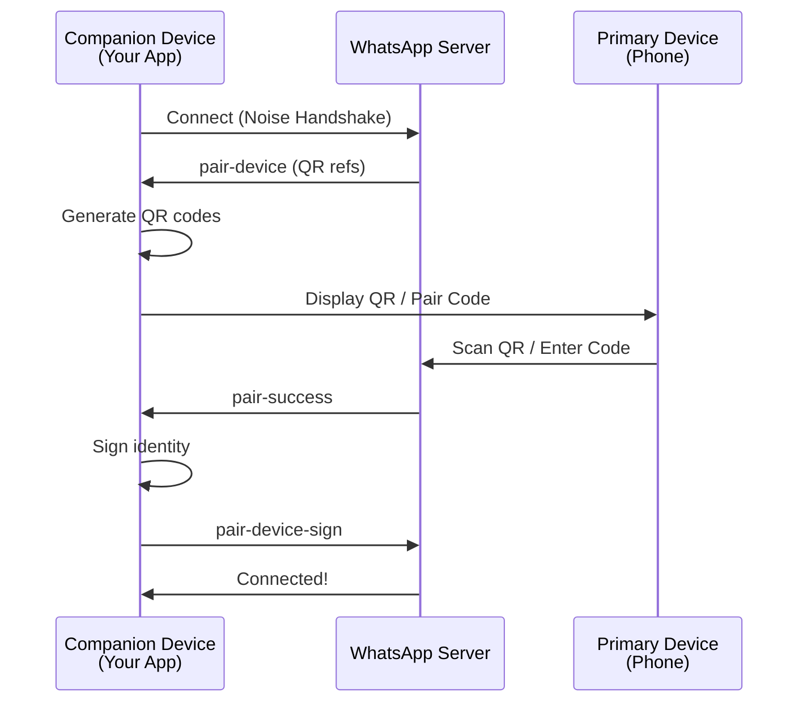
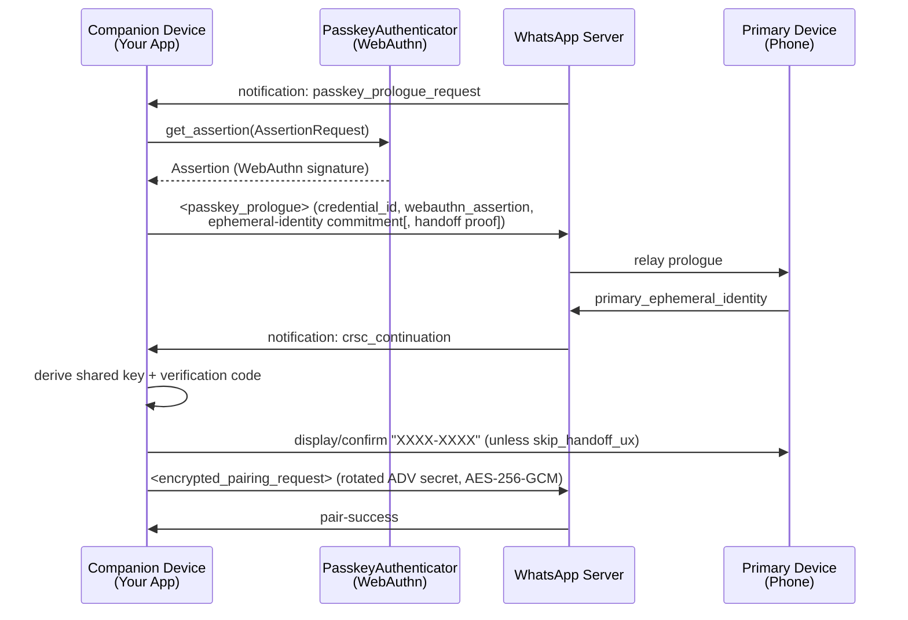

## Overview

WhatsApp-Rust supports three authentication methods for linking companion devices:

1. **QR Code Pairing** - Scan a QR code with your phone
2. **Pair Code (Phone Number Linking)** - Enter an 8-character code on your phone
3. **Passkey Linking (SHORTCAKE_PASSKEY)** - Gate the link behind a WebAuthn passkey already registered to the account

All three methods use the Noise Protocol for secure key exchange (passkey linking additionally requires a WebAuthn assertion) and can run concurrently - whichever completes first wins.

## Authentication Flow



## QR code pairing

### How it works

**Location:** `src/pair.rs`, `wacore/src/pair.rs`

1. **Server sends pairing refs:** After connection, server sends `pair-device` with multiple refs
2. **Generate QR codes:** Each ref becomes a QR code containing device keys
3. **QR rotation:** First code valid for 60s, subsequent codes for 20s each
4. **Phone scans:** User scans QR with WhatsApp > Linked Devices
5. **Crypto handshake:** Noise-based key exchange establishes trust
6. **Completion:** Server sends `pair-success`, device signs identity

### QR code contents

```rust
// src/pair.rs
// Auto-derives the client type from `device_props`.
pub fn make_qr_data(store: &Device, ref_str: &str) -> String {
    let client_type = companion_web_client_type_for_props(&store.device_props);
    make_qr_data_with_client_type(store, ref_str, client_type)
}

// Use this to override the trailing client-type field explicitly.
pub fn make_qr_data_with_client_type(
    store: &Device,
    ref_str: &str,
    client_type: CompanionWebClientType,
) -> String { /* ... */ }
```

**QR Format:** `ref,noise_pub,identity_pub,adv_secret,client_type`

- `ref`: Pairing reference from server
- `noise_pub`: Static Noise public key (32 bytes, base64)
- `identity_pub`: Signal identity public key (32 bytes, base64)
- `adv_secret`: Advertisement secret key (32 bytes, base64)
- `client_type`: Single-byte [`CompanionWebClientType`](#companionwebclienttype) wire id (e.g. `1` for Chrome, `9` for `OtherWebClient`)

<Note>
  Current WhatsApp Web emits the **5-field** form (with the trailing `client_type`). The parser (`PairUtils::parse_qr_code`) still accepts the legacy 4-field string for backwards compatibility, but `make_qr_data` always produces 5 fields.
</Note>

### Implementation

```rust
use std::sync::Arc;
use whatsapp_rust::bot::Bot;
use whatsapp_rust::TokioRuntime;
use whatsapp_rust::store::SqliteStore;
use whatsapp_rust_tokio_transport::TokioWebSocketTransportFactory;
use whatsapp_rust_ureq_http_client::UreqHttpClient;
use wacore::types::events::Event;

#[tokio::main]
async fn main() -> Result<(), Box<dyn std::error::Error>> {
    let backend = Arc::new(SqliteStore::new("whatsapp.db").await?);

    let mut bot = Bot::builder()
        .with_backend(backend)
        .with_transport_factory(TokioWebSocketTransportFactory::new())
        .with_http_client(UreqHttpClient::new())
        .with_runtime(TokioRuntime)
        .on_event(|event, _client| async move {
            match &*event {
                Event::PairingQrCode { code, timeout } => {
                    println!("Scan this QR code (valid for {}s):", timeout.as_secs());
                    println!("{}", code);
                }
                Event::PairSuccess(info) => {
                    println!("Paired as {}", info.id);
                }
                _ => {}
            }
        })
        .build()
        .await?;

    bot.run().await?.await?;
    Ok(())
}
```

### QR code events

**Event:** `Event::PairingQrCode`

```rust
// wacore/src/types/events.rs
Event::PairingQrCode {
    code: String,           // ASCII art QR or data string
    timeout: Duration,      // Validity duration (60s first, 20s subsequent)
}
```

**Generated in:** `src/pair.rs:63-116`

The rotation loop includes a **safety guard** that checks `is_logged_in()` before emitting each QR code. This prevents stale QR events from firing after pairing completes — important for single-threaded runtimes, fast auto-pair scenarios, and mock servers where the spawned task may not be polled until after pairing succeeds.

```rust
for code in codes_clone {
    // Safety guard: pairing may complete before this task gets polled
    if client_clone.is_logged_in() {
        info!("Already logged in, stopping QR rotation.");
        return;
    }

    let timeout = if is_first {
        is_first = false;
        Duration::from_secs(60)
    } else {
        Duration::from_secs(20)
    };

    client.core.event_bus.dispatch(Event::PairingQrCode { code, timeout });

    let sleep = client_clone.runtime.sleep(timeout);
    let stop = stop_rx.recv();
    futures::pin_mut!(sleep);
    futures::pin_mut!(stop);
    match futures::future::select(sleep, stop).await {
        futures::future::Either::Left(_) => {
            // Timeout elapsed — check again in case login happened during sleep
            if client_clone.is_logged_in() {
                info!("Logged in during QR timeout, stopping rotation.");
                return;
            }
        }
        futures::future::Either::Right(_) => {
            info!("Pairing complete. Stopping QR code rotation.");
            return;
        }
    }
}
```

<Note>
  The rotation uses `futures::future::select` with an `async_channel` stop signal rather than Tokio-specific primitives. This keeps the QR rotation compatible with any async runtime, since the `Client` uses the pluggable `Runtime` trait for sleep and spawn operations.
</Note>

### Native-camera deep link (open WhatsApp directly)

By default the `Event::PairingQrCode` `code` is the **raw** comma-separated string above. It is meant to be scanned from *inside* WhatsApp (**Linked Devices → Link a Device**) — it is **not** a URL and tapping it does nothing.

WhatsApp Web (`WAWebLinkDeviceQrcode`) also supports a **deep-link** shape for **iOS native-camera linking**: prefixing the same payload with a `wa.me` URL turns the QR into a link. On iOS, scanning it with the **native Camera app** (not the in-app scanner) opens WhatsApp straight to the Linked Devices screen and hands off the pairing payload via the URL fragment (`#...`).

The prefix is exported as a constant:

```rust
// wacore/src/companion_reg.rs (re-exported from whatsapp_rust::pair)
pub const NATIVE_CAMERA_DEEP_LINK_PREFIX: &str = "https://wa.me/settings/linked_devices#";
```

<Warning>
  `make_qr_data` and `Event::PairingQrCode` **never** add this prefix — the emitted string is always the raw 5-field payload. If you want the deep-link behavior you must prepend the prefix yourself before rendering the QR. `PairUtils::parse_qr_code` transparently strips the prefix, so the raw and deep-link forms are interchangeable on the scanning side.
</Warning>

#### Mini example — render a scannable deep-link QR

```rust
use whatsapp_rust::pair::NATIVE_CAMERA_DEEP_LINK_PREFIX;
use wacore::types::events::Event;

// Depends on the `qrcode` crate:  qrcode = "0.14"
fn render_qr(payload: &str) {
    use qrcode::{QrCode, render::unicode};
    let code = QrCode::new(payload).expect("valid QR payload");
    let art = code
        .render::<unicode::Dense1x2>()
        .quiet_zone(true)
        .build();
    println!("{art}");
}

// ...inside your event handler:
.on_event(|event, _client| async move {
    if let Event::PairingQrCode { code, timeout } = &*event {
        // Prepend the prefix so iOS's native Camera opens WhatsApp directly.
        let deep_link = format!("{NATIVE_CAMERA_DEEP_LINK_PREFIX}{code}");

        println!("Scan with your iOS Camera app (valid {}s):", timeout.as_secs());
        render_qr(&deep_link);

        // Tip: `deep_link` is also a working https:// URL you can share as a
        // clickable link on the device itself.
    }
})
```

Render the **raw** `code` instead of `deep_link` if you want the classic in-app scanner flow; both produce a valid, scannable code.

## Pair code (phone number linking)

### How it works

**Location:** `src/pair_code.rs`, `wacore/src/pair_code.rs`

1. **Generate code:** 8-character Crockford Base32 code
2. **Stage 1 - Hello:** Send phone number + encrypted ephemeral key
3. **Server response:** Returns pairing reference
4. **User enters code:** On phone: WhatsApp > Linked Devices > Link with phone number
5. **Stage 2 - Finish:** Phone confirms, companion sends key bundle
6. **Completion:** Server sends `pair-success`

### Pair code format

**Alphabet:** Crockford Base32 (excludes 0, I, O, U)
```
123456789ABCDEFGHJKLMNPQRSTVWXYZ
```

**Length:** Exactly 8 characters

**Example:** `ABCD1234`, `MYCODE12`

### Implementation

#### Random Code

```rust
use whatsapp_rust::pair_code::PairCodeOptions;

let options = PairCodeOptions {
    phone_number: "15551234567".to_string(),
    show_push_notification: true,
    ..Default::default()
};

let code = client.pair_with_code(options).await?;
println!("Enter this code on your phone: {}", code);
```

#### Custom Code

```rust
let options = PairCodeOptions {
    phone_number: "15551234567".to_string(),
    custom_code: Some("MYCODE12".to_string()),
    ..Default::default()
};

let code = client.pair_with_code(options).await?;
assert_eq!(code, "MYCODE12");
```

### Pair code options

```rust
// wacore/src/pair_code.rs
pub struct PairCodeOptions {
    /// Phone number in international format (e.g., "15551234567").
    /// Non-digit characters are automatically stripped.
    pub phone_number: String,

    /// Whether to show a push notification on the phone (default: `true`).
    pub show_push_notification: bool,

    /// Custom 8-character code (must be valid Crockford Base32).
    /// If `None`, a random code is generated.
    pub custom_code: Option<String>,

    /// Override for `companion_platform_id`. When `None`, the value is
    /// derived from `Device.device_props.platform_type`. The accompanying
    /// `companion_platform_display` string is always derived (it cannot
    /// be overridden separately).
    pub platform_id: Option<CompanionWebClientType>,
}
```

### CompanionWebClientType

`CompanionWebClientType` is the wire-level enum emitted in the `<companion_platform_id>` child of the pair-code IQ. Each variant has a fixed single-byte ASCII identifier returned by [`wire_byte`](https://github.com/oxidezap/whatsapp-rust/blob/main/wacore/src/companion_reg.rs):

```rust
// wacore/src/companion_reg.rs
pub enum CompanionWebClientType {
    // Web (digit codes from WAWebCompanionRegClientUtils.DEVICE_PLATFORM)
    Chrome,            // b'1'
    Edge,              // b'2'
    Firefox,           // b'3'
    Ie,                // b'4'
    Opera,             // b'5'
    Safari,            // b'6'
    Electron,          // b'7'
    Uwp,               // b'8'
    OtherWebClient,    // b'9' — default fallback
    // Mobile (letter codes from the official WhatsApp Android client).
    // Reachable only via an explicit `PairCodeOptions::platform_id` override
    // because the server requires attestation that this crate cannot fake.
    AndroidTablet,     // b'd'
    AndroidPhone,      // b'e'
    AndroidAmbiguous,  // b'f'
}
```

The proto's `UNKNOWN` (wire `'0'`) is intentionally absent — WA Web never emits it from a real browser and the server rejects it. The default is `OtherWebClient` (`'9'`). The server accepts 23 single-byte ids (`0..9` and `a..m`); only the 12 with a confirmed platform meaning are exposed.

#### Mapping from `PlatformType`

`companion_web_client_type_for_platform` maps each `wa::device_props::PlatformType` to a wire variant. Web platforms map to their browser variant (Chrome, Firefox, Edge, etc.). `Desktop` maps to `Electron`. The Android `PlatformType` variants (`AndroidPhone`, `AndroidTablet`, `AndroidAmbiguous`) map to **`Chrome`** — that's what real WA Web on Chrome-Android emits and what the server accepts without attestation. To request the Android letter codes (`'d'`/`'e'`/`'f'`) explicitly, set `PairCodeOptions::platform_id`. iOS, AR/VR, Wear OS, and the proto's `UNKNOWN` collapse to `OtherWebClient`.

#### `companion_platform_display`

The display string sent in `<companion_platform_display>` is built from the resolved wire variant and the OS reported in `DeviceProps`:

- Web variants emit `<Browser> (<OS>)`, e.g. `Chrome (Linux)`, `Firefox (Windows)`. Non-browser web variants (Electron, UWP, OtherWebClient) and Android-mapped-to-Chrome fall back to `Chrome (<OS>)`, mirroring WA Web's reported renderer name.
- Explicit `AndroidPhone`/`AndroidTablet`/`AndroidAmbiguous` overrides emit `Android (<OS>)`, e.g. `Android (Android)`.
- Empty OS substitutes `Linux`.

The server only validates that the display string is 1..=100 bytes — there is no browser whitelist.

### Pair code events

**Event:** `Event::PairingCode`

```rust
// wacore/src/types/events.rs
Event::PairingCode {
    code: String,           // The 8-character pairing code
    timeout: Duration,      // Validity (~180 seconds)
}
```

**Generated in:** `src/pair_code.rs:215-219`

```rust
self.core.event_bus.dispatch(Event::PairingCode {
    code: code.clone(),
    timeout: PairCodeUtils::code_validity(),
});
```

### Two-Stage Flow

#### Stage 1: Hello

**Purpose:** Register phone number and encrypted ephemeral key

```rust
// src/pair_code.rs:165-174
let iq_content = PairCodeUtils::build_companion_hello_iq(
    &phone_number,
    &noise_static_pub,
    &wrapped_ephemeral,
    options.platform_id,
    &options.platform_display,
    options.show_push_notification,
    req_id.clone(),
);
```

**Response:** Pairing reference

```rust
let pairing_ref = PairCodeUtils::parse_companion_hello_response(&response)
    .ok_or(PairCodeError::MissingPairingRef)?;
```

#### Stage 2: Finish

**Trigger:** `link_code_companion_reg` notification from server

**Handling:** `src/pair_code.rs:229-376`

```rust
pub(crate) async fn handle_pair_code_notification(client: &Arc<Client>, node: &Node) -> bool {
    // 1. Extract primary's wrapped ephemeral pub (80 bytes)
    // 2. Extract primary's identity pub (32 bytes)
    // 3. Decrypt primary's ephemeral key (expensive PBKDF2)
    // 4. Prepare encrypted key bundle
    // 5. Send companion_finish IQ
}
```

## Passkey linking (SHORTCAKE_PASSKEY)

### How it works

**Location:** `wacore/src/shortcake.rs` (pure crypto/protobuf core), `src/passkey/mod.rs` (the `PasskeyAuthenticator` seam), `src/passkey/flow.rs` (the client driver)

This gate requires a WebAuthn passkey **already registered** to the WhatsApp account (e.g. in Google Password Manager or iCloud Keychain) — it is not a standalone pairing method you can bootstrap from scratch like QR or pair code. The server asks the companion to prove possession of that passkey before it will hand over the ADV secret.



1. **Server requests a WebAuthn assertion:** a `passkey_prologue_request` notification carries (or points to, via IQ) the `PublicKeyCredentialRequestOptions` JSON.
2. **Companion obtains an assertion:** delegated to a registered [`PasskeyAuthenticator`](#passkeyauthenticator-trait) — e.g. Android Credential Manager — since the passkey's private key is non-extractable and never touches this crate.
3. **Ephemeral-identity commit/reveal:** the companion generates a fresh X25519 keypair and nonce, commits to them (`<passkey_prologue>`), and the primary reveals its own ephemeral identity in return (`crsc_continuation`).
4. **Shared key + verification code:** both nonces and public keys derive an AES-256-GCM key and an 8-character "XXXX-XXXX" verification code.
5. **Encrypted pairing request:** the companion encrypts its static Noise/identity public keys plus a freshly **rotated** ADV secret under that key and sends `<encrypted_pairing_request>`.
6. **Completion:** as with QR/pair-code, the server sends `pair-success` and linking finishes through the same [`PairSuccess`/`PairError`](#success-events) path.

<Note>
  The rotated ADV secret is held only in memory until [`send_passkey_confirmation`](#implementation-2) succeeds — it is committed to the device store (`DeviceCommand::SetAdvSecretKey`) only after the primary has it. An abandoned or failed attempt never leaves the device on a secret the primary never received.
</Note>

### Re-links skip the verification code

On a **re-link** (the companion already has a prior ADV secret), the client derives an HMAC "handoff proof" from that prior secret and includes it in `<passkey_prologue>`. If the server accepts it as proof of continuity, `Event::PairPasskeyConfirmation.skip_handoff_ux` is `true` and the link can complete without showing the user a code. A brand-new link always shows the code.

### `PasskeyAuthenticator` trait

**Location:** `src/passkey/mod.rs`

```rust
#[async_trait]
pub trait PasskeyAuthenticator: MaybeSendSync {
    async fn get_assertion(&self, request: &AssertionRequest) -> Result<Assertion, PasskeyError>;
}
```

```rust
pub struct AssertionRequest {
    pub challenge: Vec<u8>,               // already base64url-decoded
    pub rp_id: Option<String>,
    pub allow_credentials: Vec<Vec<u8>>,  // empty = discoverable credential
    pub user_verification: UserVerification, // Required | Preferred | Discouraged
    pub timeout_ms: Option<u64>,
    pub raw_options_json: String,         // verbatim server JSON, e.g. for Android Credential Manager
}

pub struct Assertion {
    pub assertion_json: Vec<u8>,   // WA's `<webauthn_assertion>` JSON shape
    pub credential_id: Vec<u8>,
}
```

Two helper functions parse/build the wire shapes so a host authenticator doesn't have to:

```rust
// Parses the server's PublicKeyCredentialRequestOptions JSON into an AssertionRequest
pub fn parse_request_options(json: &str) -> Result<AssertionRequest, PasskeyError>;

// Assemble WA Web's exact `<webauthn_assertion>` JSON from raw WebAuthn assertion components
// (for authenticator backends that return raw bytes instead of WA-shaped JSON).
pub fn build_webauthn_assertion_json(
    credential_id: &[u8],
    client_data_json: &[u8],
    authenticator_data: &[u8],
    signature: &[u8],
    user_handle: Option<&[u8]>,
) -> Vec<u8>;
```

If you don't need a custom integration, `CallbackAuthenticator` wraps any async closure as a `PasskeyAuthenticator`:

```rust
use std::sync::Arc;
use whatsapp_rust::passkey::{Assertion, AssertionRequest, CallbackAuthenticator, PasskeyError};

let authenticator = CallbackAuthenticator::new(|request: AssertionRequest| {
    Box::pin(async move {
        // e.g. hand `request.raw_options_json` to Android Credential Manager's
        // GetPublicKeyCredentialOption(requestJson = ...) and map the result:
        Ok(Assertion {
            assertion_json: get_webauthn_assertion_json(&request).await?,
            credential_id: get_credential_id(&request).await?,
        })
    })
});

client.set_passkey_authenticator(Arc::new(authenticator)).await;
```

### Driving modes

- **Automatic:** with `set_passkey_authenticator` called, the client drives the whole flow — it calls `get_assertion` when the server asks, sends the response, and auto-confirms re-links whose `skip_handoff_ux` is `true`. A fresh link still emits `Event::PairPasskeyConfirmation` so you can show the code before the automatic confirm.
- **Manual:** with no authenticator registered, the host drives every step from the three `Event::PairPasskey*` events (see below) and calls `send_passkey_response` / `send_passkey_confirmation` itself.

### Implementation

```rust
use std::sync::Arc;
use wacore::types::events::Event;
use whatsapp_rust::passkey::CallbackAuthenticator;

// Automatic: register an authenticator once, then just handle PairSuccess/PairError.
client.set_passkey_authenticator(Arc::new(CallbackAuthenticator::new(my_get_assertion))).await;
```

```rust
// Manual: drive each step from the events yourself.
.on_event(|event, client| async move {
    match &*event {
        Event::PairPasskeyRequest(req) => {
            let assertion = my_get_assertion_from_json(&req.request_options_json).await?;
            client.send_passkey_response(assertion).await?;
        }
        Event::PairPasskeyConfirmation(conf) => {
            if conf.skip_handoff_ux {
                client.send_passkey_confirmation().await?;
            } else {
                println!("Confirm {} matches on your phone, then continue", conf.code);
                // ...await user confirmation, then:
                client.send_passkey_confirmation().await?;
            }
        }
        Event::PairPasskeyError(err) => {
            eprintln!("Passkey link failed (continuation={}): {}", err.continuation, err.error);
        }
        Event::PairSuccess(info) => println!("Paired as {}", info.id),
        _ => {}
    }
})
```

### Passkey events

```rust
// wacore/src/types/events.rs
Event::PairPasskeyRequest(PairPasskeyRequest {
    request_options_json: String, // verbatim PublicKeyCredentialRequestOptions JSON
})

Event::PairPasskeyConfirmation(PairPasskeyConfirmation {
    code: String,            // 8-char "XXXX-XXXX" verification code
    skip_handoff_ux: bool,   // true on a proven re-link: no need to show the code
})

Event::PairPasskeyError(PairPasskeyError {
    error: String,
    continuation: bool,     // false = failed during the initial request, true = during continuation
})
```

Linking completes through the ordinary [`PairSuccess`/`PairError`](#success-events) events — there is no separate "passkey success" event.

### Client methods

| Method | Purpose |
|--------|---------|
| `set_passkey_authenticator(Arc<dyn PasskeyAuthenticator>)` | Register an authenticator to auto-drive the flow |
| `send_passkey_response(Assertion) -> Result<(), PasskeyError>` | Call after `PairPasskeyRequest`, with the obtained assertion |
| `send_passkey_confirmation() -> Result<(), PasskeyError>` | Call after `PairPasskeyConfirmation` (or automatically, for a proven re-link) |

See [Client API — Connection Management](/api/client#set_passkey_authenticator) for full signatures and error variants.

## Cryptography

### Noise protocol handshake

whatsapp-rust supports three Noise patterns to mirror WhatsApp Web:

| Pattern | When it runs | Round trips |
|---------|--------------|-------------|
| **Noise XX** | Cold start, after pairing, or any reconnect with no cached server cert chain | 1.5 (3 messages) |
| **Noise IK** | Reconnect with a valid cached `server_cert_chain` | 0.5 (2 messages) |
| **Noise XXfallback** | Server-driven recovery when an IK attempt's cached server static is stale | 0.5 (continues from IK ClientHello) |

```rust
// wacore/noise/src/handshake.rs
pub struct XxHandshakeState         { /* ... */ }  // Noise_XX_25519_AESGCM_SHA256
pub struct IkHandshakeState         { /* ... */ }  // Noise_IK_25519_AESGCM_SHA256
pub struct XxFallbackHandshakeState { /* ... */ }  // Resumes the IK transcript as XX

pub enum IkServerHelloOutcome {
    Continue(Box<IkHandshakeOutcome>),  // Cached static accepted
    Fallback(Box<IkFallbackInputs>),    // Pivot into XXfallback
}
```

**XX flow (cold start):**
1. Initiator → Responder: ephemeral pub
2. Responder → Initiator: ephemeral pub, static pub, encrypted payload (cert chain)
3. Initiator → Responder: encrypted static pub, encrypted payload

The verified `server_cert_chain` is persisted at the end of XX so the next connect can use IK.

**IK flow (resumed):**
1. Initiator → Responder: ephemeral pub, encrypted static, encrypted 0-RTT payload (built against the cached server static)
2. Responder → Initiator: ephemeral pub, encrypted payload — handshake is complete after this single round trip.

If the server's static no longer matches the cached value, step 2 returns an `IkServerHelloOutcome::Fallback(...)` and the client pivots to **XXfallback** in-place — without dropping the connection — finishing as if it had been XX from the start.

After a single crypto-fatal IK failure the client clears the cached cert chain (`DeviceCommand::ClearServerCertChain`), increments a process-local failure counter, and forces XX on the next connect. See [WebSocket & Noise Protocol — Noise Protocol Handshake](/advanced/websocket-handling#noise-protocol-handshake) for the full state machine.

### ClientProfile

**Location:** `wacore/src/client_profile.rs`

`ClientProfile` is the identity that gets baked into `ClientPayload.UserAgent` during the Noise handshake. It controls the `platform`, `device`, `os_version`, `os_build_number`, `manufacturer` fields, and whether `web_info` is attached to the payload.

It is independent of `DeviceProps` — `device_props` describes the companion entry on the phone, while `ClientProfile` describes the client identity to WhatsApp's server during the handshake itself. The two can be set independently.

```rust
// wacore/src/client_profile.rs
pub struct ClientProfile {
    pub user_agent_platform: wa::client_payload::user_agent::Platform,
    pub device: String,
    pub os_version: String,
    pub manufacturer: String,
    pub include_web_info: bool,
    pub passive_login: bool,       // ClientPayload.passive
    pub phone_id: Option<String>,  // UserAgent.phone_id (anti-abuse UUID)
    pub locale_language: String,   // UserAgent.locale_language_iso6391, e.g. "pt"
    pub locale_country: String,    // UserAgent.locale_country_iso31661_alpha2, e.g. "BR"
}
```

<Note>
Since v0.6 the locale and `phone_id` come from the active `ClientProfile` instead of being hard-coded. The locale is split into two ISO fields — `locale_language` (ISO-639-1, e.g. `"en"`) and `locale_country` (ISO-3166-1 alpha-2, e.g. `"US"`) — both written to the matching `UserAgent` proto attributes. When `phone_id` is `None` the client builds a **fresh UUID-v4 on every `ClientPayload` build**; it is not persisted on `Device`, so if you need a stable WA Web–style `WAWebClientPayload.phoneId` you must supply it yourself (e.g. generate once at install time and pass it in via your own `ClientProfile` constructor). Login counter (`ClientPayload.lc`) lives on `Device`, not here — see the [Login counter](#login-counter-clientpayloadlc) section below.

`passive_login` mirrors WA Web's `ClientPayload.passive`: `false` (the default) tells the server to deliver queued offline messages on connect, `true` keeps the connection passive until you pull explicitly.
</Note>

#### Built-in profiles

| Constructor | Platform | Device | Manufacturer | `web_info` |
|-------------|----------|--------|--------------|------------|
| `ClientProfile::web()` (default) | `Web` | `Desktop` | `""` | included |
| `ClientProfile::android(os_version)` | `Android` | `Smartphone` | `""` | omitted |
| `ClientProfile::smb_android(os_version)` | `SmbAndroid` | `Smartphone` | `""` | omitted |
| `ClientProfile::ios(os_version)` | `Ios` | `iPhone` | `Apple` | omitted |
| `ClientProfile::macos(os_version)` | `Macos` | `Desktop` | `Apple` | omitted |
| `ClientProfile::windows(os_version)` | `Windows` | `Desktop` | `""` | omitted |

The `web()` profile reproduces the legacy desktop-web payload (`os_version` and `os_build_number` are both `"0.1.0"`). Native profiles propagate the supplied `os_version` to both fields and drop `web_info`.

#### Setting a profile

`Device.client_profile` is `#[serde(skip)]`, so it is never persisted. Set it on every fresh process before calling [`connect()`](/api/client#connect):

```rust
use whatsapp_rust::ClientProfile;

client.set_client_profile(ClientProfile::android("13")).await;
client.connect().await?;
```

Internally this dispatches `DeviceCommand::SetClientProfile(profile)` through the persistence manager (see [State Management](/advanced/state-management#deviceCommand-pattern)).

### Key Derivation

**For QR Code:**
```rust
// Direct key exchange - keys in QR code
```

**For Pair Code:**
```rust
// wacore/src/pair_code.rs
// Expensive PBKDF2 operation (wrapped in spawn_blocking)
let wrapped_ephemeral = tokio::task::spawn_blocking(move || {
    PairCodeUtils::encrypt_ephemeral_pub(&ephemeral_pub, &code_clone)
}).await?;
```

**Parameters:**
- **Algorithm:** AES-256-CBC
- **KDF:** PBKDF2-HMAC-SHA256
- **Iterations:** 2^16 (65,536)
- **Salt:** 16 random bytes
- **IV:** 16 random bytes

### Signal protocol setup

**After pairing:**
1. Server sends signed device identity
2. Companion verifies signature
3. Identity keys exchanged
4. Pre-keys registered

```rust
// src/pair.rs:188-209
let result = PairUtils::do_pair_crypto(&device_state, &device_identity_bytes);

match result {
    Ok((self_signed_identity_bytes, key_index)) => {
        // Store device JID, LID, account info
        client.persistence_manager
            .process_command(DeviceCommand::SetId(Some(jid.clone())))
            .await;
        client.persistence_manager
            .process_command(DeviceCommand::SetAccount(Some(signed_identity)))
            .await;
    }
    Err(e) => {
        // Send error to server
    }
}
```

### Login counter (`ClientPayload.lc`)

Since v0.6 the client persists a `login_counter` on `Device`. Every successful connect increments it and the new value is sent as `ClientPayload.lc` during the Noise handshake. This mirrors WA Web's anti-abuse signal — the server uses the counter to spot replayed or cloned `ClientPayload`s. The counter resets when you call `logout()` or wipe device state.

## Concurrent Pairing

Both methods can run simultaneously:

```rust
// Start QR code (automatic on connection)
bot.run().await?;

// Also start pair code in parallel
let code = client.pair_with_code(options).await?;
```

**State Management:**
```rust
// src/client.rs
pub(crate) pairing_cancellation_tx: Mutex<Option<async_channel::Sender<()>>>,
pub(crate) pair_code_state: Mutex<PairCodeState>,
```

**Cancellation:**
```rust
// src/pair.rs:140-149
async fn handle_pair_success(...) {
    // Cancel QR code rotation if active
    if let Some(tx) = client.pairing_cancellation_tx.lock().await.take() {
        let _ = tx.try_send(());
        debug!("Sent QR rotation stop signal");
    } else {
        // is_logged_in guard will stop the task even without the channel
        debug!("QR rotation channel not yet stored — is_logged_in guard will stop the task");
    }

    // Clear pair code state if active
    *client.pair_code_state.lock().await = PairCodeState::Completed;
}
```

The `is_logged_in()` safety guard in the rotation loop acts as a fallback — even if the cancellation channel hasn't been stored yet (race condition on fast pairing), the rotation task will exit cleanly on its next iteration.

## Success Events

### PairSuccess

```rust
// wacore/src/types/events.rs
#[derive(Debug, Clone, Serialize)]
pub struct PairSuccess {
    pub id: Jid,                // Device JID (e.g., "15551234567.0:1@s.whatsapp.net")
    pub lid: Jid,               // LID JID (e.g., "100000012345678.0:1@lid")
    pub business_name: String,  // Push name / business name
    pub platform: String,       // Platform identifier
}

Event::PairSuccess(PairSuccess { id, lid, business_name, platform })
```

### PairError

```rust
#[derive(Debug, Clone, Serialize)]
pub struct PairError {
    pub id: Jid,
    pub lid: Jid,
    pub business_name: String,
    pub platform: String,
    pub error: String,          // Error description
}

Event::PairError(PairError { /* ... */ })
```

## Error Handling

### QR code errors

```rust
// Handled internally, retries with new QR codes
// If all QR codes expire, disconnects:
info!("All QR codes for this session have expired.");
client.disconnect().await;
```

### Pair code errors

`pair_with_code` returns `whatsapp_rust::pair_code::PairError`, which wraps the wacore-side validation/crypto errors (`PairCodeError`) and the IQ transport layer (`IqError`):

```rust
use whatsapp_rust::pair_code::PairError;
use wacore::pair_code::PairCodeError;

match client.pair_with_code(options).await {
    Ok(code) => println!("Code: {}", code),
    Err(PairError::PairCode(PairCodeError::PhoneNumberRequired)) => {
        eprintln!("Phone number is required");
    }
    Err(PairError::PairCode(PairCodeError::PhoneNumberTooShort)) => {
        eprintln!("Phone number must be at least 7 digits");
    }
    Err(PairError::PairCode(PairCodeError::PhoneNumberNotInternational)) => {
        eprintln!("Phone number must not start with 0 (use international format)");
    }
    Err(PairError::PairCode(PairCodeError::InvalidCustomCode)) => {
        eprintln!("Custom code must be 8 valid Crockford Base32 characters");
    }
    Err(PairError::PairCode(PairCodeError::MissingPairingRef)) => {
        eprintln!("Server did not return a pairing reference");
    }
    Err(PairError::PairCode(PairCodeError::NotWaiting)) => {
        eprintln!("No pending pair code request");
    }
    Err(PairError::PairCode(PairCodeError::InvalidWrappedData { expected, got })) => {
        eprintln!("Invalid wrapped data: expected {} bytes, got {}", expected, got);
    }
    // Typed crypto failures preserve their `CurveError`/`CryptoProviderError` source
    Err(PairError::PairCode(PairCodeError::InvalidPrimaryEphemeralKey(e))) => {
        eprintln!("Primary device sent an invalid ephemeral key: {e}");
    }
    Err(PairError::PairCode(PairCodeError::InvalidPrimaryIdentityKey(e))) => {
        eprintln!("Primary device sent an invalid identity key: {e}");
    }
    Err(PairError::PairCode(PairCodeError::EphemeralKeyAgreement(e))) => {
        eprintln!("Ephemeral DH failed: {e}");
    }
    Err(PairError::PairCode(PairCodeError::IdentityKeyAgreement(e))) => {
        eprintln!("Identity DH failed: {e}");
    }
    Err(PairError::PairCode(PairCodeError::AdvSecretKeyDerivation)) => {
        eprintln!("HKDF expand for adv_secret failed");
    }
    Err(PairError::PairCode(PairCodeError::BundleKeyDerivation)) => {
        eprintln!("HKDF expand for bundle encryption key failed");
    }
    Err(PairError::PairCode(PairCodeError::BundleAead(e))) => {
        eprintln!("AES-GCM encryption of key bundle failed: {e}");
    }
    Err(PairError::RequestFailed(iq)) => {
        eprintln!("Pair-code IQ request failed: {iq}");
    }
}
```

The previous catch-all `CryptoError(String)` and `RequestFailed(String)` variants have been split into typed variants that preserve their underlying source. Match on `std::error::Error::source()` (or downcast it) to inspect the inner `CurveError`, `CryptoProviderError`, or `IqError`.

## Session Persistence

### After successful pairing

**State saved to storage:**
- Device JID (Phone Number)
- LID (Long-term Identifier)
- Identity keys
- Noise keys
- Registration ID
- Push name

**Next connection:**
```rust
// No pairing needed - automatic reconnection
let bot = Bot::builder()
    .with_backend(backend)
    .with_transport_factory(TokioWebSocketTransportFactory::new())
    .with_http_client(UreqHttpClient::new())
    .with_runtime(TokioRuntime)
    .build()
    .await?;

bot.run().await?; // Uses saved session
```

### Logout

```rust
// Clear session data
client.logout().await?;

// Event emitted:
Event::LoggedOut(LoggedOut {
    on_connect: false,
    reason: ConnectFailureReason::LoggedOut,
})
```

## Best Practices

### Phone number format

<CodeGroup>
```rust ✅ Correct
let options = PairCodeOptions {
    phone_number: "15551234567".to_string(),  // International format
    // Non-digits automatically stripped:
    // phone_number: "+1-555-123-4567".to_string(),
    ..Default::default()
};
```

```rust ❌ Wrong
let options = PairCodeOptions {
    phone_number: "0551234567".to_string(),   // Don't start with 0
    phone_number: "5551234567".to_string(),   // Missing country code
    ..Default::default()
};
```
</CodeGroup>

### Event Handling

```rust
.on_event(|event, client| async move {
    match &*event {
        Event::PairingQrCode { code, timeout } => {
            // Display QR to user
            println!("Valid for: {}s", timeout.as_secs());
        }
        Event::PairingCode { code, timeout } => {
            // Display code to user
            println!("Enter {} on your phone", code);
        }
        Event::PairSuccess(info) => {
            // Save success notification
            println!("Paired: {}", info.id);
        }
        Event::PairError(err) => {
            // Handle error
            eprintln!("Pairing failed: {}", err.error);
        }
        _ => {}
    }
})
```

### Concurrent Usage

```rust
// Both methods active - whichever completes first wins
tokio::spawn(async move {
    if let Ok(code) = client.pair_with_code(options).await {
        println!("Pair code: {}", code);
    }
});

// QR codes automatically generated and rotated
bot.run().await?;
```

## Related Sections

<CardGroup cols={2}>
  <Card title="Architecture" icon="sitemap" href="/concepts/architecture">
    Understand the project structure
  </Card>
  <Card title="Events" icon="bolt" href="/concepts/events">
    Learn about all event types
  </Card>
  <Card title="Storage" icon="database" href="/concepts/storage">
    Explore session persistence
  </Card>
  <Card title="Quick Start" icon="rocket" href="/quickstart">
    Build your first bot
  </Card>
</CardGroup>